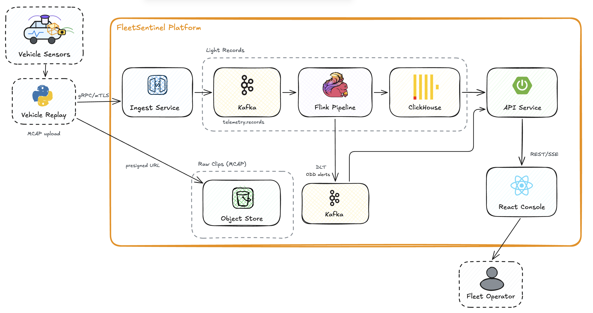

# FleetSentinel

[한국어](README.md) | [English](README-en.md)

An autonomous-driving platform for ingesting vehicle signals and sensor files and viewing abnormal
states in a fleet console.


Docs (Korean): [System Design Document](docs/sdd.md) · [Data Design](docs/data-design.md) · [Frontend tech notes](docs/frontend-tech-notes.md) · [Ingestion design review](docs/ingestion-design-review.md) · [WAL design](docs/wal-design.md) · [Ack & dedup design](docs/ack-dedup-design.md) · [Runbook](RUN.md)

## Background

This project started from the real-time speeding detection work in [AutoNotify](https://github.com/Qualcomm-Capstone),
a Qualcomm-sponsored capstone. Feedback from the final presentation was that scaling a single-vehicle
demo to a fleet requires separate designs for ingestion, storage, and operations.

## The Problem

Data from a single autonomous vehicle includes **signals** (CAN, IMU, steering), **object metadata**
(3D boxes, tracks), and **raw sensors** (6 cameras, LiDAR, 5 radars).

These data types have different transfer sizes and message rates, so they use separate paths.

1. Raw sensor data uses 58× more bandwidth than signals, while signals produce 8× more messages.
2. One vehicle's raw output exceeds practical LTE throughput, so it cannot be streamed continuously.

The input data was collected from **2 vehicles**, and the longest continuous stretch is about
20 seconds. In this repository, **"N vehicles" means N concurrent streams**.

Measured figures (rates, sizes, formats, and per-channel detail) are listed in [Data Design](docs/data-design.md).

## Architecture



Signals and object metadata go through Kafka and Flink. Raw sensor files go to object storage, with
references recorded in Kafka. ClickHouse's clip catalog connects the two paths.

## Key Design Decisions

| Problem | Solution |
|---|---|
| 58× bandwidth asymmetry | **Claim-Check** — references on the bus, payloads in storage |
| Not even one vehicle can stream continuously | **Triggered clips** — onboard ring buffer, upload ±20s around events |
| Recovery after an interrupted upload | **Per-record gRPC stream + onboard WAL** ([WAL](docs/wal-design.md)) |
| Sensor rates span hundreds-fold | **Three timestamps** + keyframe synchronization anchor |
| Coordinates are not lat/lon | **Official-origin ENU→WGS84 conversion** |
| Raw logs must replay standalone | **MCAP with embedded calibration** |
| Duplicate delivery and gap detection | **Cumulative Acknowledgement (CACK) + `seq` sliding-window dedup** ([design](docs/ack-dedup-design.md)) |
| ODD exits must be visible immediately | **Flink keyed state/timer → Kafka alert → API SSE** |
| Operators need the source around an alert | **Clip catalog `blob_uri` → object-storage replay** |

## Stack

| Layer | Technology | Role |
|---|---|---|
| Ingest and buffering | Apache Kafka | Buffers vehicle records, fans them out to processing and storage, and supports replay |
| Stream processing | Apache Flink | Maintains per-vehicle state for deduplication, validation, coordinate conversion, and ODD detection |
| Raw storage | Object storage + MCAP | Stores large sensor clips as files for later replay |
| Time-series storage | ClickHouse | Stores and queries signals, object metadata, and the clip catalog |
| API | Spring Boot | Exposes ClickHouse queries and Kafka alerts through REST and SSE |
| Console | React · MapLibre GL · uPlot · Rerun | Shows vehicle positions, signals, alerts, and sensor clips |

Signals and object metadata go through Kafka, Flink, and ClickHouse. Raw sensor files go to object
storage. The two paths are connected by the clip ID and `blob_uri`.

## Known Limitations

Current scope and limitations are listed in [SDD §4.2](docs/sdd.md).

- **Not live monitoring.** nuScenes replay reproduces bandwidth, cadence, and format, but there is no real-vehicle integration.
- **Vehicle-side loss prevention was verified in the replayer only.** WAL, ack, and dedup are implemented and survive SIGKILL with zero `seq` gaps, but real onboard software is out of scope, and the power-loss window (10ms group commit) remains.
- **The console uses a mock stream by default.** `make dashboard` connects it to the real API, but Kafka→Flink→API latency and recovery have not been measured end to end.
- **The source is 2 vehicles with a 20-second continuity ceiling.** "N vehicles" means N concurrent streams, not N distinct real vehicles.
- **Infrastructure HA is out of scope.** A single-host 3-broker setup demonstrates broker-level failover only.
- **3D boxes come from nuScenes annotations.** They are not produced by the vehicle and are used only to show surrounding objects in the dashboard.
- **Radar payloads unparsed** — `.pcd` files are stored in MCAP but not decoded or visualized.

## Layout

```
FleetSentinel/
├── frontend/         # (React) ops console — map, time series, clip search, sensor replay
├── exploration/      # (Python) measurement/verification tools + vehicle-side loss prevention (WAL, ack, dedup)
├── flink-pipeline/   # (Java) dedup, validation, coordinate derivation, ODD detection
├── infra/            # docker-compose (Kafka ×3, Flink, ClickHouse, MinIO)
├── schemas/          # canonical Avro schemas
├── scripts/          # infra smoke tests · Kafka HA demo
└── docs/             # design documents
```

## Running

```bash
make up        # start the local stack
make topics    # bootstrap Kafka topics
make smoke     # verify infrastructure
make ha-demo   # Kafka HA broker-kill demo
```

```bash
cd exploration && ./setup-venv.sh && PYTHONPATH=. .venv/bin/python -m pytest tests/ -q   # 82 tests
cd frontend && npm install && npm run dev      # console (mock SSE stream)
```

See [`exploration/README.md`](exploration/README.md) and [`frontend/README.md`](frontend/README.md).
The `exploration/` directory mixes two things: measurement tools (not promotable to production)
and the vehicle-side loss-prevention implementation (a faithful build of the documented design,
minus real onboard hardware).

## License

[MIT License](LICENSE). nuScenes data is subject to Motional's non-commercial terms and is not included in this repository.
