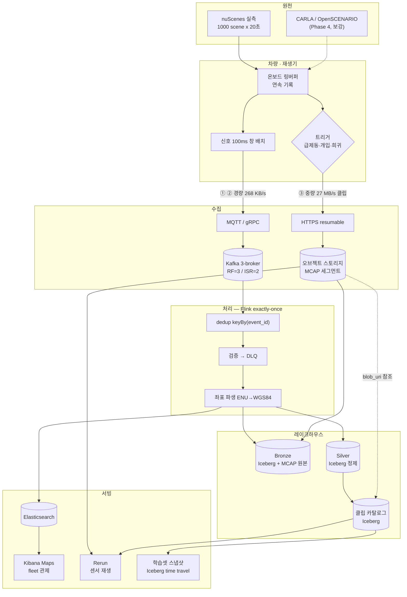

# FleetSentinel — System Design Document (v3.0)

| 항목 | 값 |
|---|---|
| 버전 | 3.0 — 자율주행 멀티모달 |
| 상태 | 설계 확정 · P1(수집 계층) 구현·검증 완료 |
| 최종 갱신 | 2026-08-23 |
| 대체 대상 | v2.0(차량 OBD 텔레메트리) 전면 폐기 |
| 관련 문서 | [데이터 설계](data-design-v3.md) · [실행 절차](../RUN.md) · [수집 계층](../exploration/README.md) |

> 이 문서의 모든 수치는 **실측값**이다. nuScenes mini 10장면(196.5초)을 전수 측정해 얻었고,
> 측정 스크립트는 `exploration/scripts/`에 있다. 추정치는 "추정"이라고 명시한다.

---

## 1. 개요

### 1.1 이 프로젝트가 무엇인가

**자율주행 차량·로봇이 쏟아내는 멀티모달 센서 데이터를 수집하고, 관제하고, 머신러닝
학습셋으로 큐레이션하는 데이터 플랫폼**이다.

한 문장으로 줄이면 이렇다.

> **모델을 학습시키는 프로젝트가 아니라, 모델을 학습시킬 수 있는 데이터를 만드는 시스템이다.**

자율주행 회사에서 데이터 엔지니어가 실제로 하는 일이 이것이다. 인지 모델을 만드는 건
ML 엔지니어의 몫이고, 그 모델이 먹을 데이터를 수백만 시간의 주행 로그에서 찾아내고,
정제하고, 버전을 고정해 재현 가능하게 만드는 것이 데이터 엔지니어의 몫이다.
Tesla·Waymo가 "Data Engine"이라 부르는 층이다.

### 1.2 무엇을 다루는가

차량 한 대가 만들어내는 데이터는 성격이 완전히 다른 세 계층으로 갈린다. **이 비대칭이
이 시스템 설계 전체를 결정한다.**

| 계층 | 내용 | 메시지/초 | 대역폭 |
|---|---|---|---|
| ① **신호** | CAN 버스, IMU, 조향, 차량 자세 | **1,466** | 230 KB/s |
| ② **인지 산출** | 3D 객체 박스, 트랙, 클래스 | 2.1 | 39 KB/s |
| ③ **원시 센서** | 카메라 6대 · LiDAR · 레이더 5대 | 159 | **27.15 MB/s** |

대역폭은 **99배** 차이인데 메시지 건수는 오히려 신호가 **9배** 많다. 하나의 파이프라인으로
둘 다 처리하려는 순간 설계가 무너진다.

### 1.3 데이터 원천

**nuScenes** — 보스턴·싱가포르 실도로에서 수집된 공개 자율주행 데이터셋. 합성이 아니라
실측이며, 원래 타임스탬프대로 재생해 실시간 스트림으로 흘린다. CARLA/OpenSCENARIO는
실주행에 부족한 시나리오를 의도적으로 만드는 2차 원천으로 나중에 붙인다(§5).

### 1.4 시스템 아키텍처



핵심은 **경량 경로와 중량 경로의 분리(Claim-Check)** 다. 메시지 버스에는 참조와
메타데이터만 흐르고, 무거운 센서 원본은 오브젝트 스토리지로 직행한다. 둘은 클립
카탈로그에서 다시 만난다.

### 1.5 현재 상태

| 단계 | 범위 | 상태 |
|---|---|---|
| P0 | 로컬 인프라(Kafka HA·Flink·Iceberg·ES·Kibana) | ✅ 완료 |
| **P1** | **nuScenes 수집·MCAP 변환·Rerun 재생** | ✅ **완료** |
| P2 | 스키마 확정 · 배치 재생기 → Kafka | 다음 |
| P3 | Flink 파이프라인 재작성 | 대기 |
| P4 | Claim-Check · 클립 카탈로그 · 관제 · 데이터엔진 | 대기 |

---

## 2. 핵심 요구사항 및 문제 정의

측정에서 도출된 문제만 적는다. 각 문제는 §3에 **1:1로 대응되는 해결책**이 있다.

### 요구사항

| ID | 요구사항 |
|---|---|
| R-1 | 수집한 데이터를 **유실 없이** 보존하고, 유실 0을 증명할 수 있어야 한다 |
| R-2 | 원본 로그를 **나중에 그대로 재생·재처리**할 수 있어야 한다 |
| R-3 | fleet 위치·상태를 **실시간 관제** 화면으로 볼 수 있어야 한다 |
| R-4 | 조건을 걸어 **학습용 클립을 검색**하고, 그 집합을 **재현 가능하게 고정**할 수 있어야 한다 |
| R-5 | 노트북 한 대(Apple Silicon)에서 전 구간이 돌아야 한다 |

### 비기능 요구사항 (NFR)

**처리량·지연 목표는 이 문서에서 확정하지 않는다.** 현재 단계는 "어떤 데이터가 들어오는가"를
정의하는 것이고, 처리량 목표는 파이프라인 설계에서 정해야 한다.

측정에서 먼저 도출된 잠정 수치는 [`pipeline-notes-provisional.md`](pipeline-notes-provisional.md)에
격리해 뒀다. 확정된 것은 데이터 쪽 사실뿐이다.

| 항목 | 값 | 성격 |
|---|---|---|
| 차량당 신호 발생률 | 1,295 rec/s (432 KB/s) | **실측** |
| 차량당 원시 센서 | 27.15 MB/s · 159 파일/s | **실측** |
| 차량당 인지 산출 | 2.1 msg/s (39 KB/s) | **실측** |
| 유실률 | 0 — `event_id` 집합 대사로 증명 | 요구사항 (R-1) |
| 관제 조회 p99 | < 300ms | 목표치 |

### 문제

#### P-1. 대역폭이 99배 다른 스트림을 한 경로로 못 나른다

차량 1대 실측 27.15 MB/s. 500대면 **13.6 GB/s**다. Kafka로 나를 수 있는 양이 아니다.
반대로 신호는 230 KB/s로 가볍지만 **초당 1,466건**이라 건수가 많다.

#### P-2. 차량 1대도 원시 데이터를 연속 업로드할 수 없다

27.15 MB/s > LTE 실효 대역폭 약 12.5 MB/s. **한 대조차 물리적으로 불가능**하다.

#### P-3. 초당 1,466개의 잘린 메시지는 Kafka에 최악의 패턴이다

레코드 하나가 약 180바이트다. 500대면 **734,080 msg/s**. 브로커 오버헤드가 페이로드를
압도한다.

| 채널 | 실측 Hz | 비고 |
|---|---|---|
| `zoesensors` | **955** | 페달·조향 원시 센서, 간격 0.25ms까지 |
| `ego_pose` | 158.8 | |
| `ms_imu` / `zoe_veh_info` / `steeranglefeedback` | ~99 | |
| `pose` | 49.8 | |
| `vehicle_monitor` | 2.0 | |

`zoesensors` 한 채널이 신호 메시지의 **65%** 를 차지한다.

#### P-4. 센서마다 클럭도 주기도 다르다

955Hz부터 2Hz까지 **478배** 범위에 걸쳐 있고, 각자 다른 클럭을 쓴다. 어느 시점의
카메라 프레임과 어느 LiDAR 스윕이 같은 순간인지 정의하지 않으면 조인이 성립하지 않는다.

#### P-5. 좌표가 위경도가 아니다

`ego_pose.translation`은 **지역 지도의 ENU 로컬 미터 좌표**이고 z는 항상 0이다.
Kibana Maps는 WGS84 `geo_point`를 요구한다. 커뮤니티에는 "보스턴은 1.35배 스케일링이
필요하다"는 정체 불명의 보정이 떠돈다.

#### P-6. 원본 로그가 그 자체로 재생 가능해야 한다 (R-2)

센서마다 좌표 프레임이 다르다. LiDAR는 센서 프레임, 인지 박스는 글로벌 프레임이다.
**캘리브레이션이 함께 보존되지 않으면 원본이 있어도 3D로 재생할 수 없다.**

#### P-7. 수집은 at-least-once인데 유실 0과 중복 0을 동시에 증명해야 한다 (R-1)

Kafka는 at-least-once다. 재시도 중복이 그대로 저장되면 분석이 오염되고, 중복을 막겠다고
과하게 제거하면 유실이 숨는다.

#### P-8. 라벨의 23%가 신뢰할 수 없다 (R-4)

`num_lidar_pts = 0`인 주석이 **18,538건 중 4,278건(23.1%)** 이다. LiDAR가 한 점도 맞히지
못한 객체이므로 학습셋에 그대로 넣으면 안 된다.

#### P-9. 시나리오 다양성이 부족하다 (R-4)

mini 10장면 태그 실측:

| 태그 | 출현 |
|---|---|
| 보행자 | 8 / 10 |
| 자전거 · 교차로 · 버스 | 5 / 10 |
| 야간 | 3 / 10 |
| **활성 강우** | **1 / 10** |
| 주간 명시 | **0 / 10** |

기상 축은 사실상 쓸 수 없고, "주간"은 명시가 없어 **부정 추론**에 의존한다.

#### P-10. 20초 클립이라 지속 부하를 만들 수 없다 (R-5)

전체 재생시간이 mini 195초, full로 가도 5.4시간이다. 루프하면 같은 `event_id`가 다시
들어오는데, 새로 발급하면 dedup을 검증할 수 없고 유지하면 전부 삼켜진다.

---

## 3. 해결 방법

§2의 문제와 **1:1로 대응**한다.

### S-1 ← P-1. Claim-Check(참조 전달) 패턴

무거운 것은 오브젝트 스토리지로 직행시키고, 버스에는 **참조와 메타데이터만** 흘린다.

```
③ 원시 27 MB/s ──▶ MCAP 세그먼트 ──▶ 오브젝트 스토리지
                                          │ blob_uri · checksum · 시간범위
① ② 경량 268 KB/s ─────────────────────┐  │
                                        ▼  ▼
                              Kafka ─▶ Flink ─▶ 클립 카탈로그(두 경로 결합)
```

경량 경로는 **500대에서도 137 MB/s**로 Kafka가 충분히 감당한다.

### S-2 ← P-2. 트리거 기반 클립 업로드 + 온보드 링버퍼

연속 업로드를 포기하고 산업 표준 방식을 따른다. 차량은 로컬 링버퍼에 연속 기록하고,
**트리거(급제동·개입·인지 불확실·희귀 상황)가 걸린 앞뒤 20~30초만 업로드**한다.

거의 모든 공개 AD 데이터셋이 클립 구조인 것이 이 방식이 표준임을 보여준다 —
nuScenes 20초, Waymo Open Motion 20초, Argoverse 2 15초. **20초 클립은 우회할 제약이
아니라 이 도메인의 자연스러운 데이터 단위다.**

### S-3 ← P-3. 시간창 배치 (잠정)

신호를 고정 시간창으로 묶어 메시지 하나로 보낸다. 창 크기별 트레이드오프를 실측했고
**100ms를 잠정 선택**했다 — 메시지 수가 1/131로 줄고, 43.4 KB가 Kafka 기본
`max.message.bytes` 1MB 안에 들어가며, 추가 지연 100ms는 지도 관제에서 체감되지 않는다.

| 창 | msg/s/대 | rec/msg | 500대 msg/s | 추가 지연 |
|---|---|---|---|---|
| 없음 | 1,295.2 | 1.0 | 647,610 | 0 ms |
| **100 ms** | **9.8** | **131.5** | **4,925** | **≤100 ms** |
| 1000 ms | 1.0 | 1,233.6 | 525 | ≤1000 ms |

> ⚠️ **이건 전송 설계 영역이라 확정이 아니다.** 창 크기·계약·처리량 목표의 상세와
> 재검토 지점은 [`pipeline-notes-provisional.md`](pipeline-notes-provisional.md)에 격리했다.
> 500대 환산치는 산술 외삽이며 **부하 시험 결과가 아니다.**

**`zoesensors` 937Hz는 다운샘플하지 않는다.** `ego_pose` 시각(20Hz)에 최근접 결합하면
이 채널의 98%가 버려진다. 네이티브 주기로 싣고 메시지 수는 배치로 흡수한다.

### S-4 ← P-4. 타임스탬프 3종 + 키프레임 앵커

| 타임스탬프 | 부여 주체 | 용도 |
|---|---|---|
| `sensor_time` | 센서 자체 클럭 | **정본 시간축** — 파티션·정렬 기준 |
| `log_time` | 온보드 기록 시점 | 온보드 버퍼링 지연 관측 |
| `ingest_time` | 파이프라인 수신 시점 | 전송 지연 `ingest_time - sensor_time` |

**동기화 앵커는 키프레임(2Hz)** 이다. nuScenes가 6센서를 정렬하는 단위이며 3D 라벨도
여기에만 붙는다. 센서 간 조인은 키프레임을 기준으로 하고, 그 사이 고주파 신호는
해당 키프레임 구간에 귀속시킨다.

**지연 데이터는 폐기하지 않는다.** watermark를 넘겨 도착해도 `sensor_time` 파티션에
그대로 적재한다 — R-1(유실 0)과 정합하는 유일한 선택이다.

### S-5 ← P-5. 공식 원점 기반 ENU→WGS84 변환

원점은 추정이 아니라 `nuscenes-devkit` `map_expansion/map_api.py` 45–49행의 **공식
문서화 값**이다. 그리고 "보스턴 1.35배"의 정체를 규명했다.

| 지역 | 원점 위도 | `1/cos(lat)` |
|---|---|---|
| boston-seaport | 42.3368° | **1.3528** ← 보고된 "1.35" |
| singapore 3곳 | ~1.29° | 1.0003 |

**Web Mercator(EPSG:3857) 축척계수였다.** 싱가포르는 적도 근처라 보정이 불필요했고
보스턴만 필요했던 것이다. **로컬 접평면 또는 대권 방식으로 직접 변환하면 어떤 보정
상수도 필요 없다.**

검증: 왕복 오차 1e-6 mm · 10/10 장면이 지도 래스터(10px/m) 범위 내 · 거리 오차
≤0.014% · 독립 구현(nuscenes2mcap)과 최대 36cm 일치.

Bronze에는 **ENU 원본을 그대로** 두고 `lat`/`lon`은 Silver 파생으로 둔다. 변환 오차를
원본에 섞지 않기 위함이다.

### S-6 ← P-6. MCAP + 캘리브레이션 내장

원본 컨테이너로 **MCAP**을 쓴다. 이종 타임스탬프 메시지를 채널별로 담고, **스키마를
파일에 내장**하며(self-describing), 인덱스가 있어 구간 랜덤 액세스가 된다. ROS 2 Iron부터
rosbag2 기본 포맷이다.

| 채널 | 인코딩 | 계층 |
|---|---|---|
| `/vehicle/signal` | jsonschema | ① |
| `/perception/objects` | jsonschema | ② |
| **`/tf/calibration`** | jsonschema | 센서 외부/내부 파라미터 |
| `/camera/CAM_*` | jpeg | ③ |
| `/lidar/LIDAR_TOP` | octet-stream | ③ |
| `/radar/RADAR_*` | octet-stream | ③ |

`/tf/calibration`이 P-6의 직접적 답이다. 이것 없이는 MCAP만으로 3D 재생이 불가능하다.
**검증 방법은 재생기가 MCAP만 읽게 하는 것** — devkit도 원본 데이터셋도 참조하지 않는다.
이게 돌아가면 원본이 자체충족적이라는 뜻이다.

### S-7 ← P-7. exactly-once 4단 조합

| 단계 | 메커니즘 |
|---|---|
| 발급 | 재생기가 `event_id`(ULID)를 **1회 발급**, 재전송에도 불변 |
| 수집 | Kafka at-least-once (`acks=all`) |
| 오프셋 | Flink 체크포인트에 컨슈머 오프셋 포함 → 장애 시 정렬 재생 |
| dedup | `keyBy(event_id)` + 상태 TTL 30분 |
| Iceberg | 체크포인트 단위 2PC 원자 커밋 — 부분 쓰기 없음 |
| ES | `doc_id=event_id` 멱등 upsert |

**증명 방법**: `event_id` 집합 대사. 발행 집합이 `Silver ∪ DLQ`에 포함되는지 확인한다.
오프셋 대리값이 아니라 실제 id 집합의 교집합이라 유실을 숨길 수 없다.

파싱·검증 실패 레코드는 버리지 않고 **DLQ로 격리**한다(4분류). 은닉 유실 0.

### S-8 ← P-8. 품질 플래그를 큐레이션 1급 축으로

`num_lidar_pts = 0`은 예외 처리가 아니라 **주요 큐레이션 축**이다(23.1%).

| 규칙 | 조치 |
|---|---|
| `num_lidar_pts = 0` | 행 유지 + `low_confidence` 플래그 → 학습셋 제외 후보 |
| `visibility` 4단계 | 난이도 계층화 축 |
| 키프레임에 6센서 미충족 | 클립에 `sensor_dropout` 플래그 |
| `sensor_time` 역전 | 경고 태그(폐기 안 함) |
| 물리 범위 위반 | `BUSINESS_RULE_FAILURE` → DLQ |

학습셋은 **Iceberg 스냅샷으로 고정**한다. time travel로 "v3 모델은 정확히 이 데이터로
학습됐다"가 재현 가능해진다.

### S-9 ← P-9. 시뮬 보강 폐루프

```
① 마이닝    조건 쿼리 → 클립 목록
② 커버리지  조건별 클립 수 → 부족 구간 식별
③ 보강      CARLA/OpenSCENARIO로 부족분 생성 → ①로 환류
④ 스냅샷    선정 집합을 Iceberg 스냅샷으로 고정
```

P-9의 측정(활성 강우 1/10)이 이 루프를 **가설이 아니라 실측된 필요**로 만든다.
기상 축은 실데이터만으로 채울 수 없다.

### S-10 ← P-10. replay_epoch 분리 + 의도적 중복 주입

- `event_id` 발급에 **`replay_epoch`를 포함**해 루프마다 정당한 새 이벤트로 만든다.
- 중복 테스트는 **별도 주입 비율**(`--inject-duplicate`)로 제어한다.
- 지속 부하는 세 축의 조합으로 만든다: **동시성**(N대 배분) × **시간**(루프) × **압축**(배속).

전송과 검증의 관심사를 분리하는 것이 요점이다.

---

## 4. Alternative Considerations & Limitations

### 4.1 고려했으나 채택하지 않은 대안

#### A-1. 원시 센서를 Kafka로 직접 전송

| | Kafka 직접 | **Claim-Check (채택)** |
|---|---|---|
| 구현 | 단순 — 경로 하나 | 복잡 — 경로 둘 + 결합 |
| 500대 처리량 | 13.6 GB/s (불가) | 137 MB/s |
| 재처리 | 토픽 보존기간에 종속 | 오브젝트 스토리지 영구 |

**기각 이유**: 27 MB/s × N을 브로커가 감당하지 못한다. 단순함의 이점이 물리적 한계 앞에서 무의미하다.

#### A-2. 시계열 DB(Prometheus/InfluxDB)에 저장

| | TSDB | **Iceberg + 오브젝트 스토리지 (채택)** |
|---|---|---|
| 스칼라 집계 | 우수 | 보통 |
| 개별 이벤트 정체성 | 없음 — 멱등키·감사 개념 부재 | `event_id` 단위 대사 가능 |
| 지오공간 | 위경도를 독립 시계열로만 취급 | `geo_point` 색인 |
| 원본 보존 | 다운샘플 후 폐기가 전제 | 무손실 |

**기각 이유**: 카디널리티 때문이 아니다(500대 × 스칼라 8개는 TSDB에 부담이 아니다).
**개별 이벤트의 정체성과 유실 0 증명**이 이 프로젝트의 핵심 논지인데 TSDB는 그 모델이 아니다.

#### A-3. 로그 포맷으로 rosbag2(sqlite3) 또는 Parquet 직접

| | rosbag2 sqlite3 | Parquet | **MCAP (채택)** |
|---|---|---|---|
| 이종 메시지 | 가능 | 어려움 — 컬럼형 전제 | 가능 |
| 스키마 자기기술 | 부분적 | 스키마 내장 | 내장 |
| 구간 랜덤 액세스 | 가능 | 가능 | 인덱스 내장 |
| 바이너리 블롭(이미지·점군) | 가능 | 부적합 | 적합 |
| 생태계 | ROS 한정 | 분석계 표준 | 로보틱스 표준 |

**기각 이유**: Parquet은 구조화 컬럼 데이터에 최적이라 JPEG·점군 blob에 맞지 않는다.
rosbag2 sqlite3는 ROS 밖 생태계가 얇다. 다만 **Silver의 구조화 데이터는 Iceberg(Parquet)**
로 가므로 둘은 배타적이지 않다 — 계층별로 다른 포맷을 쓴다.

#### A-4. 시각화로 Foxglove

| | Foxglove | **Rerun (채택)** |
|---|---|---|
| MCAP 네이티브 | 우수 — 자체 포맷 | 직접 읽지 않음(변환 필요) |
| 라이선스 | OSS 중단(2024-02 v1.87.0 이후 상용) | MIT / Apache-2.0 |
| Apple Silicon | 가능 | 네이티브 |
| 멀티모달 시계열 | 우수 | 설계 목표가 그것 |

**기각 이유**: 오픈소스 버전이 중단됐다. 포트폴리오 프로젝트가 상용 계정에 종속되면
재현성이 깨진다. TIER IV 등의 OSS 포크가 있으나 유지보수 주체가 불명확하다.

#### A-5. 원천으로 CARLA를 1차 사용

| | CARLA 1차 | **nuScenes 1차 (채택)** |
|---|---|---|
| 시나리오 제어 | 완전 | 불가 — 재생만 |
| 데이터 진정성 | 합성 | **실측** |
| Apple Silicon | x86+GPU 요구, 사실상 불가 | CPU만으로 동작 |
| 라벨 | 자동 생성(완벽하지만 비현실적) | 사람 라벨 + 실제 결함 23% 포함 |

**기각 이유**: R-5(노트북에서 동작)를 위반하고, "실데이터가 아니다"라는 근본 지적을
해소하지 못한다. CARLA는 **2차 보강**으로 남긴다(S-9).

#### A-6. `foxglove/nuscenes2mcap`을 그대로 사용

**기각 이유**: Python 3.11 전용이고 map expansion 패키지를 추가 요구한다. 무엇보다
출력이 ROS 메시지 타입 기준이라 **우리 3계층 스키마 형태가 아니다**. 다만 좌표 변환
구현은 교차 검증에 사용했다(최대 36cm 일치).

#### A-7. 신호를 원시 레이트로 전송(배치 없이)

**기각 이유**: §3 S-3의 표 참조. 500대에서 734,080 msg/s이고 180바이트 페이로드에 대해
브로커 오버헤드가 지배적이다. 배치의 대가는 **최대 100ms 지연 추가**이며, 관제 요구
(R-3)에서 100ms는 무시 가능하다.

### 4.2 한계 (Not Covered)

여기서 **다루지 않는** 문제들을 명시한다.

| # | 한계 | 이유 |
|---|---|---|
| L-1 | **실제 차량 연동** | 실차·실센서 접근 없음. nuScenes 재생이 대역폭·주기·형식을 재현하지만 **라이브 관제가 아니다.** "실측 로그 기반 관제 플랫폼"으로 기술한다 |
| L-2 | **온보드 소프트웨어** | 링버퍼·트리거 로직(S-2)은 차량 측 컴포넌트다. 설계에는 포함하되 **구현하지 않는다** |
| L-3 | **인프라 HA** | Kafka는 단일 호스트 3브로커라 **broker-level 복제·failover만** 실증한다. 호스트·존 SPOF는 스코프 밖 |
| L-4 | **인지 모델 학습·추론** | 인지 산출은 nuScenes 라벨을 사용한다. 모델을 만들지도 돌리지도 않는다 |
| L-5 | **레이더 페이로드 해석** | `.pcd`를 MCAP에 싣기만 하고 파싱·시각화는 미구현 |
| L-6 | **full 데이터셋 규모 검증** | mini(10장면)로만 측정했다. full 1000장면은 48.8GB로 **추정**이며 미검증 |
| L-7 | **보안·인증** | MQTT/gRPC의 mTLS, 오브젝트 스토리지 접근 제어는 설계에 없다. 로컬 개발 전제 |
| L-8 | **개인정보** | nuScenes는 얼굴·번호판이 익명화된 상태로 배포된다. **자체 익명화 파이프라인은 없다** |
| L-9 | **비용 모델** | 클라우드 미배포. 오브젝트 스토리지 비용(하루 2.3TB/대)은 산정만 하고 최적화하지 않는다 |
| ~~L-10~~ | ~~MCAP 스윕 누락~~ | ✅ **해소.** 전 채널 `sample_data` 체인을 순회하도록 수정했다. 3장면 검증에서 정본 대비 2,963/2,963 · 3,063/3,063 · 3,171/3,171로 **누락 0**. 회귀 방지 게이트를 `verify_mcap.py`에 상설화했다. 장면당 MCAP 49MB → 357MB |

L-10은 이후 해소됐으나 **결함이 있었다는 기록 자체를 남긴다** — 무손실 주장이 검증 없이
통과했던 경로가 있었다는 뜻이고, 그래서 상설 게이트를 붙였다.

---

## 5. Rollout & Rollback

### 5.1 단계별 계획

| 단계 | 범위 | 완료 기준 | 상태 |
|---|---|---|---|
| **P0** | 로컬 인프라 | `make smoke` 통과, `make ha-demo` 유실 0 | ✅ |
| **P1** | nuScenes 수집·MCAP·Rerun | MCAP 검증 9항목 통과, 좌표 종단 검증 오차 0 | ✅ |
| **P2** | 스키마 3종 확정 · 100ms 배치 재생기 → Kafka | N대 동시 재생이 Kafka에 적재, 배치율 실측 | 다음 |
| **P3** | Flink 재작성 (dedup·검증·DLQ·Iceberg·ES) | `event_id` 집합 대사 유실 0, 체크포인트 성공 | |
| **P4** | Claim-Check · 클립 카탈로그 | 경량·중량 경로가 `blob_uri`로 결합 | |
| **P5** | 관제 (Kibana fleet 지도 + Rerun) | 다수 차량이 지도에서 동시 이동 | |
| **P6** | 데이터엔진 (마이닝·스냅샷·커버리지) | 조건 쿼리 → 클립 재생, 스냅샷 재현 | |
| **P7** | 프로토콜 계층 (MQTT/gRPC) | 차량→클라우드 구간 재현 | |
| **P8** | CARLA 보강 (스트레치) | 부족 시나리오 생성 → 카탈로그 환류 | |

**P2 착수 전 선결 3건 — 완료**

| # | 항목 | 결과 |
|---|---|---|
| 1 | MCAP 스윕 누락 수정 | ✅ 정본 대비 누락 0, 상설 게이트 추가. 장면당 49MB → 357MB |
| 2 | 신호 배치 정책 확정 | ✅ **100ms 창** 채택. `zoesensors` 다운샘플 **안 함**(무손실). 신호를 채널 네이티브 주기로 전환 |
| 3 | NFR 재산정 | ✅ §2 NFR 표. 500대 = **4,925 msg/s · 648,000 rec/s · 212 MB/s** |

세그먼트 분할 단위는 **클립 1개 = MCAP 1파일**(357MB)로 확정한다. 시간 구간 분할은
`log-segment`에 세그먼트 순번을 추가해야 하고, 20초 클립에서 얻는 이점이 크지 않다.

### 5.2 Rollback

| 대상 | 방식 |
|---|---|
| 스키마 변경 | Iceberg 스키마 진화로 하위호환. 파괴적 변경은 새 테이블 + 이중 기록 후 전환 |
| Flink 잡 | 마지막 성공 체크포인트에서 재시작. Iceberg 2PC라 부분 쓰기 없음 |
| Silver 재생성 | **Bronze에서 배치 재처리**. Bronze는 append-only이므로 언제나 진실의 원천 |
| ES 인덱스 | 서빙 사본이므로 삭제 후 Silver에서 재색인 |
| 클립 카탈로그 | Iceberg 스냅샷 롤백(time travel) |
| 데이터 원본 | **롤백 불가 — 삭제하지 않는다.** MCAP 원본은 보존이 전제 |

**설계 원칙**: 서빙 계층은 언제나 버리고 다시 만들 수 있어야 하고, 원본 계층은 절대
지우지 않는다.

---

## 6. 관측 및 테스트 방법

### 6.1 두 종류의 데이터를 구분한다

| | 제품 데이터 | 운영 메트릭 |
|---|---|---|
| 대상 | 차량 텔레메트리·센서 | 파이프라인 자신의 상태 |
| 저장 | Kafka → Iceberg / ES | Prometheus |
| 유실 허용 | **불가 — 유실 0이 계약** | 허용 |
| 시각화 | Kibana · Rerun | Grafana |

### 6.2 관측 지표

| 항목 | 메트릭 | 경보 임계 |
|---|---|---|
| 수집 백로그 | Kafka consumer lag | 10분 연속 증가 |
| 파이프라인 지연 | `lag = ingest_time - sensor_time` p99 | > 5분 |
| 체크포인트 | Flink `lastCheckpointDuration` | > 60초 또는 실패 |
| **유실 감시** | DLQ 메시지 수 | **> 0 (즉시)** |
| 배치 효율 | 메시지당 레코드 수 | < 100 (배치 미달) |
| 센서 결손 | `sensor_dropout` 클립 비율 | > 5% |
| 업로드 실패 | MCAP checksum 불일치 | > 0 |

### 6.3 테스트 전략

| 층 | 방법 | 현재 |
|---|---|---|
| 단위 | pytest — 좌표 변환 계약(왕복·축방향·거리보존·원점) | **30건 통과** |
| 포맷 | MCAP 되읽기 — 인덱스·내장 스키마·메시지 수·구간 랜덤 액세스·매직바이트 | **3장면 × 9항목 통과** |
| 기하 | 박스 안 LiDAR 포인트를 세어 라벨 `num_lidar_pts`와 대조 | **31,911 포인트 오차 0** |
| 인프라 | `make smoke` — 전 서비스 healthy·토픽·ES·MinIO·Kibana | 통과 |
| 가용성 | `make ha-demo` — 브로커 하드 kill → 리더 재선출 → 유실 0 | **published 5600 = consumed 5600** |
| 정합 | `event_id` 집합 대사 (발행 ⊆ Silver ∪ DLQ) | P3에서 복원 |
| 부하 | 가설 우선 — 목표 RPS·p99 SLO를 **런 전에 봉인**하고 결과와 대조 | P2 이후 |

### 6.4 기하 검증이 왜 결정적인가

3D 박스 안의 LiDAR 포인트를 직접 세어 nuScenes 라벨과 대조했더니 **31,911개 포인트에
대해 오차 0**이었다(축 순서를 바꾸면 58%).

이 값이 맞으려면 `LiDAR 센서 프레임 → 캘리브레이션 외부파라미터 → ego 자세 → 글로벌
프레임 → 박스 로컬 프레임` **다섯 단계가 전부** 정확해야 한다. 한 링크만 틀려도 일치하지
않는다. 즉 육안 확인 없이 좌표 체인 전체를 기계적으로 증명할 수 있다.

**원칙**: 사람 눈으로만 판단 가능한 항목은 최소화한다. 현재 육안 전용으로 남은 것은
카메라 이미지의 3D 투영 각도뿐이며, 이는 시각화 표현이지 데이터 정합이 아니다.

### 6.5 검증하지 않은 것

- Elasticsearch·Kibana 기동 (이미지 미캐시로 P1 검증 범위 밖)
- full 데이터셋(1000장면) 규모 변환
- 나머지 7개 장면의 기하 검증 (동일 파이프라인이라 일반화했으나 전수는 아님)
- 레이더 페이로드 해석

---

## 부록 A. 실측 요약

측정 기반: nuScenes mini 10장면, 196.5초, 차량 1대분.

### 원시 센서 채널별

| 채널 | Hz | 평균 크기 | 대역폭 |
|---|---|---|---|
| LIDAR_TOP | 20.0 | 678.1 KB | 13.90 MB/s |
| CAM_FRONT_RIGHT | 11.9 | 183.2 KB | 2.23 MB/s |
| CAM_FRONT_LEFT | 11.9 | 177.7 KB | 2.17 MB/s |
| CAM_FRONT | 11.9 | 176.5 KB | 2.15 MB/s |
| CAM_BACK_RIGHT | 11.9 | 180.0 KB | 2.20 MB/s |
| CAM_BACK_LEFT | 11.8 | 170.8 KB | 2.07 MB/s |
| CAM_BACK | 11.8 | 157.8 KB | 1.90 MB/s |
| RADAR_FRONT | 13.4 | 9.1 KB | 0.12 MB/s |
| RADAR_BACK_RIGHT | 13.4 | 8.6 KB | 0.12 MB/s |
| RADAR_BACK_LEFT | 13.4 | 8.4 KB | 0.12 MB/s |
| RADAR_FRONT_RIGHT | 13.6 | 6.3 KB | 0.09 MB/s |
| RADAR_FRONT_LEFT | 13.7 | 5.4 KB | 0.08 MB/s |
| **합계** | **158.8** | | **27.15 MB/s** |

### fleet 규모별

| 차량 | Kafka msg/s (배치 전) | Kafka 대역폭 | 스토리지 | 하루 |
|---|---|---|---|---|
| 1 | 1,468 | 268 KB/s | 27 MB/s | 2.3 TB |
| 10 | 14,682 | 2.7 MB/s | 272 MB/s | 23.5 TB |
| 100 | 146,816 | 27.5 MB/s | 2,715 MB/s | 235 TB |
| 500 | 734,080 | 137 MB/s | 13,575 MB/s | 1,173 TB |

### 데이터셋

| 항목 | mini | full |
|---|---|---|
| 장면 | 10 | 1,000 |
| 재생시간 | 195초 | 5.4시간 (추정) |
| 용량(원본) | 5.34 GB | ~535 GB |
| 주석 | 18,538 | ~1.4M |

---

## 부록 B. 용어

| 용어 | 설명 |
|---|---|
| Claim-Check | 무거운 페이로드를 스토리지에 두고 메시지에는 참조만 싣는 패턴 |
| MCAP | 이종 타임스탬프 메시지용 self-describing 컨테이너. ROS 2 기본 bag 포맷 |
| 키프레임(sample) | 전 센서가 정렬되는 2Hz 시점. 3D 라벨이 붙는 유일한 시점 |
| 스윕(sweep) | 키프레임 사이의 비정렬 센서 프레임 |
| ENU | East-North-Up 로컬 접평면 좌표계 |
| DLQ | Dead-Letter Queue. 처리 실패 레코드를 버리지 않고 격리 |
| Data Engine | 로그에서 학습 데이터를 발굴·큐레이션·버전관리하는 폐루프 |
