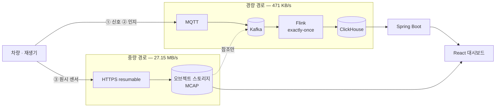

# FleetSentinel — System Design Document (v3.0)

| 항목 | 값 |
|---|---|
| 버전 | 3.0 — 자율주행 멀티모달 |
| 상태 | 설계 확정 · P1(수집 계층) 구현·검증 완료 |
| 최종 갱신 | 2026-08-23 |
| 대체 대상 | v2.0(차량 OBD 텔레메트리) 전면 폐기 |
| 관련 문서 | [데이터 설계](data-design.md) · [수집 계층 검토](ingestion-design-review.md) · [WAL 설계](wal-design.md) · [실행 절차](../RUN.md) |

> 이 문서의 모든 수치는 **실측값**이다. nuScenes mini 10장면(196.5초)을 전수 측정해 얻었고,
> 측정 스크립트는 `exploration/scripts/`에 있다. 추정치는 "추정"이라고 명시한다.
>
> **표기 규약** — "차량 N대"는 항상 **동시 스트림 N개**를 뜻한다. 원천 데이터를 수집한 실제
> 차량은 **2대**이므로 서로 다른 실차량 N대의 데이터는 존재하지 않는다.
> 상세는 [데이터 설계 §2.1.2](data-design.md).

---

## 1. 개요

### 1.1 이 프로젝트가 무엇인가

**자율주행 차량·로봇이 쏟아내는 멀티모달 센서 데이터를 수집하고, 관제하고, 머신러닝
학습셋으로 큐레이션하는 데이터 플랫폼**이다.

한 문장으로 줄이면 이렇다.

> **모델을 학습시키는 프로젝트가 아니라, 모델을 학습시킬 수 있는 데이터를 만드는 시스템이다.**

자율주행 회사에서 데이터 엔지니어가 실제로 하는 일이 이것이다. 인지 모델을 만드는 건
ML 엔지니어의 몫이고, 그 모델이 먹을 데이터를 수백만 시간의 주행 로그에서 찾아내고,
정제하고, 버전을 고정해 재현 가능하게 만드는 것이 데이터 엔지니어의 몫이다.
Tesla·Waymo가 "Data Engine"이라 부르는 층이다.

### 1.2 무엇을 다루는가

차량 한 대가 만들어내는 데이터는 성격이 완전히 다른 **세 계층**으로 갈린다 —
**① 신호**(CAN·IMU·조향·자세), **② 인지 산출**(3D 박스·트랙), **③ 원시 센서**(카메라 6대·
LiDAR·레이더 5대).

**대역폭은 원시가 58배 무거운데 메시지 건수는 신호가 8배 많다.** 이 비대칭이 이 시스템
설계 전체를 결정한다 — 하나의 파이프라인으로 둘 다 처리하려는 순간 무너진다.

> 계층별 실측 수치(Hz·크기·형식·채널별 상세)는 **[데이터 설계 §1, §3](data-design.md)** 이
> 정본이다. 이 문서는 수치를 다시 적지 않고 설계 판단만 다룬다.

### 1.3 데이터 원천

**nuScenes** — 보스턴·싱가포르 실도로에서 수집된 공개 자율주행 데이터셋. 합성이 아니라
실측이며, 원래 타임스탬프대로 재생해 실시간 스트림으로 흘린다. CARLA/OpenSCENARIO는
실주행에 부족한 시나리오를 의도적으로 만드는 2차 원천으로 나중에 붙인다(§5).

### 1.4 시스템 아키텍처

차량이 만드는 데이터는 **경량과 중량으로 갈라져 서로 다른 경로를 탄다.** 이것이 이 시스템의
가장 중요한 구조적 결정이며, 근거는 §2 P-1·P-2와 §3 S-1이다.



**원시 센서가 전체 데이터의 98.3%인데 메시지 버스를 타지 않는다.** 파일은 오브젝트
스토리지로 직행하고, 버스에는 **"어디에 무엇이 있다"는 참조만** 흐른다.

#### 경량 경로 — 신호·인지 산출

```
차량
 │  ① 신호       CAN·IMU·조향·자세      432 KB/s
 │  ② 인지 산출   3D 박스·트랙·클래스      39 KB/s
 ▼
WAL (온보드, append-only)  ← 축적 창을 닫는다. 서버가 반환한 seq까지 커밋 전진
 │                            ⚠️ L-2로 미구현 — "닫는 방법을 설계했다"
 ▼  gRPC 스트림 (차량→게이트웨이, mTLS) · 레코드 단위 계약 + seq
게이트웨이(stateless) ─▶ Kafka   ← 프로듀서 linger.ms 로 전송 계층 배치
 │                        ├─ telemetry.signals      9.8 msg/s/대 · 43 KB
 │                        ├─ telemetry.perception   2.1 msg/s/대 · ~25 KB
 │                        ├─ telemetry.segments     클립당 1건 · <2 KB   ← 중량 경로의 참조
 │                        └─ telemetry.dlq          0이 목표
 ▼
Flink (exactly-once)
 ├─ dedup      keyBy(vehicle_id) + seq 슬라이딩 윈도우(4,096) — 상태 350 KB/500대
 ├─ 검증        범위·쿼터니언·단조성 → 실패는 DLQ 4분류
 └─ 파생        ENU 미터 → WGS84 위경도
 │
 ▼
ClickHouse
 ├─ 신호·인지 시계열
 └─ 클립 카탈로그   ← segments 참조가 여기서 두 경로를 잇는다
```

**고주파에 gRPC를 쓰는 이유** — 유실 구멍이 MQTT보다 5개 적고, **게이트웨이가 stateless**라
차량 수 확장이 LB 뒤 인스턴스 추가로 끝난다. 게이트웨이가 상태를 안 가져도 되는 것은
**WAL이 차량에 있어 재연결 시 어디부터 다시 보낼지 아는 덕**이다 — 유실 방지와 확장성이
같은 결정에서 나온다. 대가는 **ack 프로토콜 직접 구현**(gRPC 스트림에 메시지별 ack가 없다).

**저주파는 MQTT 5.0을 쓴다** — `segment-ref`·차량 상태·heartbeat·(장래) 명령. 셀룰러 단절을
전제한 프로토콜이고 **LWT로 차량 오프라인을 즉시 검출**한다. 고주파 스트림이 끊긴 것과
차량이 죽은 것을 구별하려면 이 채널이 필요하다.

**MQTT는 Kafka가 아니다** — 되감기가 없고 컨슈머 그룹도 없어 브리지가 필요하다.
로컬 개발에서는 업링크 계층 전체를 건너뛰고 재생기가 Kafka에 직접 쓴다(§5.1 P7).

#### 중량 경로 — 원시 센서

```
차량
 │  ③ 원시 센서   카메라 6 · LiDAR 1 · 레이더 5     27.15 MB/s
 ▼
온보드 링버퍼         ← 연속 기록, 덮어쓰기
 │
 ▼  트리거 발생 (급제동 · 개입 · 인지 불확실 · 희귀 상황)
앞뒤 20~30초를 MCAP 세그먼트로 잘라냄
 │
 ▼  HTTPS resumable upload
오브젝트 스토리지
 │
 ▼  ★ 업로드 완료 후에 발행
telemetry.segments  { blob_uri, checksum, t_start/end, sensor_channels, calibration }
 │
 ▼
Flink ─▶ ClickHouse 클립 카탈로그
```

**차량 1대의 27.15 MB/s는 LTE 실효 대역폭(약 12.5 MB/s)을 넘는다** — 한 대조차 연속 업로드가
불가능하다. 그래서 트리거 클립이 최적화가 아니라 **물리적 필연**이다(§2 P-2).

**순서가 계약이다.** 파일 업로드가 **완료된 뒤에** 참조를 발행한다. 반대로 하면 아직 존재하지
않는 파일을 가리키는 카탈로그 행이 생긴다. 체크섬을 참조에 실어 소비자가 무결성을 검증할 수
있게 한다.

> ⚠️ **순서만으로는 한쪽 실패만 막힌다.** 업로드 성공 후 발행 전에 죽으면 **파일은 있는데
> 카탈로그에 없는 고아 파일**이 남는다. 오브젝트 스토리지와 메시지 버스 두 시스템의 일관성
> 문제이므로 **dual-write이고 outbox가 표준 해법**이다.
>
> **온보드 WAL이 그 outbox 역할을 겸한다** — 업로드 성공 시 `segment-ref`를 WAL에 append하고
> 전송기가 거기서 읽어 발행한다. 상세는 [WAL 설계 §3.9](wal-design.md).

**캘리브레이션이 참조에 포함된다.** 없으면 원본 로그만으로 3D 재구성이 불가능하다 — LiDAR는
센서 프레임, 인지 박스는 글로벌 프레임이라 정렬되지 않는다([데이터 설계 §6.2](data-design.md)).

#### 두 경로가 만나는 곳

```
ClickHouse 클립 카탈로그 (1행 = 클립 1개)
┌──────────────────────────────────────────────────────────┐
│ clip_id · t_range · location                             │
│ 조건 태그    night / rain / peds / harsh_brake …          │  ← 경량 경로에서
│ 인지 요약    n_objects · n_zero_lidar · max_speed         │  ← 경량 경로에서
│ blob_uri     s3://…/scene-0061.mcap                      │  ← 중량 경로에서
└──────────────────────────────────────────────────────────┘
        │
        ├─▶ 시나리오 마이닝: 조건으로 검색 → blob_uri로 원본 재생
        └─▶ 학습셋 스냅샷: 선정 집합을 불변 스냅샷으로 고정
```

경량 경로가 **검색 가능한 메타데이터**를 만들고, 중량 경로가 **실제 내용물**을 보관한다.
둘을 잇는 것이 `blob_uri`다 — 이 패턴을 Claim-Check라 부른다.

> 계층별 실측 수치(Hz·크기·형식·채널별 상세)는 **[데이터 설계 §1, §3](data-design.md)** 이
> 정본이다. 위 수치는 논지에 필요한 만큼만 인용했다.

### 1.5 기술 스택

버전은 **실제 확인한 값**이다. 갱신 시 호환 근거를 함께 적는다.

| 계층 | 채택 | 버전 | 근거 |
|---|---|---|---|
| 스트림 버스 | **Apache Kafka** (KRaft) | 4.x | 3-broker RF=3 / ISR=2로 broker-level HA 실증 |
| 스트림 처리 | **Apache Flink** | **2.3.0** (2026-06) | Java 17이 기본·권장. Java 21은 **실험적**이라 채택 안 함 |
| 원시 로그 저장 | 오브젝트 스토리지 + **MCAP** | — | 로컬 MinIO. MCAP은 ROS 2 기본 bag 포맷 |
| 구조화 저장·질의 | **ClickHouse** | **26.3 LTS** (`:lts` 태그) | §4.1 A-8 |
| API | **Spring Boot** | **4.0.x** (2025-11 릴리스) | Spring Framework 7.x · Jakarta EE 11 · Servlet 6.1 |
| 프론트엔드 | **React + Vite** | — | 대시보드는 클라이언트 앱 — SSR 불필요 |
| 지도 | **MapLibre GL JS** | — | 오픈소스. 궤적이 많아지면 deck.gl 추가 |
| 시계열 차트 | **uPlot** | — | 시계열 특화, 경량 |
| 센서 재생 | **`@rerun-io/web-viewer-react`** | Rerun SDK와 동일 마이너 | 이미 만드는 `.rrd`를 그대로 임베드 |
| 고주파 업링크 | **gRPC 스트림** (차량→**stateless 게이트웨이**) | — | ① 유실 구멍이 MQTT보다 5개 적다 ② **게이트웨이가 stateless**라 차량 수 확장이 LB 인스턴스 추가로 끝난다. 대가는 ack 프로토콜 직접 구현 ([검토](ingestion-design-review.md) §4.8) |
| 저주파 업링크 | **MQTT 5.0** (`segment-ref`·상태·heartbeat) | — | 셀룰러 단절 전제 + LWT 오프라인 검출 |
| 실시간 푸시 | **SSE** | — | 서버→클라이언트 단방향이면 충분. WebSocket보다 단순 |
| 탐색 도구 | Python | 3.12 | `exploration/` — 파이프라인 아님 |

#### Java 버전이 모듈마다 다르다

Spring Boot 4는 **Java 17 최소 / 25까지 지원**이고, Flink 2.3은 **Java 17이 기본이며 21은
실험적**이다. 하나로 맞추면 어느 한쪽이 손해라 모듈별로 나눈다.

| 모듈 | Java | 근거 |
|---|---|---|
| Spring Boot API | **21** (LTS) | SB4 지원 범위 안, 라이브러리 생태계 성숙. Java 25도 LTS이고 지원되나 성숙도를 보고 21 채택 |
| Flink 잡 | **17** | Flink 기본·권장. 실험적 지원을 감수할 이유가 없다 |

#### 채택하지 않은 것

| | 이유 |
|---|---|
| ~~Elasticsearch~~ | §4.1 **A-8** — 지리 인덱스가 불필요한 규모 + Kibana 대체됨 |
| ~~Kibana~~ | 자체 대시보드로 대체 |
| ~~BigQuery / 웨어하우스~~ | §4.1 **A-2** — 필요를 찾지 못함 |
| ~~Apache Iceberg~~ | 보류 — 학습셋 스냅샷 버저닝이 실제로 필요해질 때(P6) 도입. **대가는 Flink 싱크의 2PC 원자 커밋을 잃는 것**이고 멱등 upsert로 대체한다(S-7, L-14). Iceberg REST 카탈로그 컨테이너는 그때를 위해 남겨둔다 |

### 1.6 현재 상태

상세와 완료 기준은 §5.1이 정본이다. 요약하면:

| 단계 | 범위 | 상태 |
|---|---|---|
| P0 | 로컬 인프라 (Kafka HA · Flink · ClickHouse · 오브젝트 스토리지) | ✅ |
| **P1** | **데이터 정의** — 규모·형식 실측, 좌표계 규명, 무손실 검증 | ✅ |
| **P1.5** | **수집 계층 설계 + 온보드 유실 방지** — WAL·누적 ack·`seq` dedup | ✅ 재생기에서 검증 |
| **P1.6** | **관제 대시보드** — 지도·시계열·클립 검색·센서 재생 | ✅ 목업 스트림 |
| P2 | 스키마 확정 · **레코드 단위** 재생기 → Kafka | 다음 |
| P3 | Flink 파이프라인 · ClickHouse 적재 | 대기 |
| P5 | Spring Boot API — 대시보드를 실 API로 전환 | 대기 |
| P6 | 데이터엔진 (시나리오 마이닝 · 학습셋 매니페스트) | 대기 |

**클라우드 측 파이프라인이 아직 비어 있다.** 검증된 것은 차량 측 경로와 대시보드이고,
그 사이를 잇는 Kafka→Flink→ClickHouse가 P2·P3다. 이 순서가 계획대로는 아니었다(§5.1).

인프라는 §1.5 결정에 맞춰 정리됐다 — Elasticsearch·Kibana를 제거하고 ClickHouse 26.3 LTS를
투입해 기동·질의·지리 함수를 실측 확인했다. Spring Boot는 P5에서 추가한다.

---

## 2. 핵심 요구사항 및 문제 정의

측정에서 도출된 문제만 적는다. 각 문제는 §3에 **1:1로 대응되는 해결책**이 있다.

### 요구사항

| ID | 요구사항 |
|---|---|
| R-1 | 수집한 데이터를 **유실 없이** 보존하고, 유실 0을 증명할 수 있어야 한다 |
| R-2 | 원본 로그를 **나중에 그대로 재생·재처리**할 수 있어야 한다 |
| R-3 | fleet 위치·상태를 **실시간 관제** 화면으로 볼 수 있어야 한다 |
| R-4 | 조건을 걸어 **학습용 클립을 검색**하고, 그 집합을 **재현 가능하게 고정**할 수 있어야 한다 |
| R-5 | 노트북 한 대(Apple Silicon)에서 전 구간이 돌아야 한다 |

### 비기능 요구사항 (NFR)

**처리량·지연 목표는 확정하지 않는다.** 현재 단계는 "어떤 데이터가 들어오는가"를 정의하는
것이고, 목표치는 파이프라인 설계에서 정해야 한다.

- 차량당 실측치와 스케일링 함수 → **[데이터 설계 §3.4](data-design.md)**
- 측정에서 먼저 도출된 잠정 목표 → [`pipeline-notes-provisional.md`](pipeline-notes-provisional.md)

확정된 요구사항은 둘뿐이다 — **유실률 0**(차량별 `seq` 결번 0으로 증명, R-1)과
**관제 조회 p99 < 300ms**(목표치).

### 문제

#### P-1. 대역폭이 58배 다른 스트림을 한 경로로 못 나른다

차량 1대 실측 **27.15 MB/s**. 스트림 500개면 13.6 GB/s다. Kafka로 나를 수 있는 양이 아니다.
반대로 신호는 432 KB/s로 가볍지만 **초당 1,295건**이라 건수가 많다.
(채널별 실측 → [데이터 설계 §3](data-design.md))

#### P-2. 차량 1대도 원시 데이터를 연속 업로드할 수 없다

27.15 MB/s > LTE 실효 대역폭 약 12.5 MB/s. **한 대조차 물리적으로 불가능**하다.

#### P-3. 초당 1,295개의 잘린 메시지는 Kafka에 최악의 패턴이다

레코드 하나가 평균 **342바이트**다. 스트림 500개면 **647,610 msg/s**. 브로커 오버헤드가
페이로드를 압도한다.

| 채널 | 실측 Hz | 비고 |
|---|---|---|
| `zoesensors` | **955** | 페달·조향 원시 센서, 간격 0.25ms까지 |
| `ego_pose` | 158.8 | |
| `ms_imu` / `zoe_veh_info` / `steeranglefeedback` | ~99 | |
| `pose` | 49.8 | |
| `vehicle_monitor` | 2.0 | |

`zoesensors` 한 채널이 신호 메시지의 **65%** 를 차지한다.

#### P-4. 센서마다 클럭도 주기도 다르다

955Hz부터 2Hz까지 **478배** 범위에 걸쳐 있고, 각자 다른 클럭을 쓴다. 어느 시점의
카메라 프레임과 어느 LiDAR 스윕이 같은 순간인지 정의하지 않으면 조인이 성립하지 않는다.

#### P-5. 좌표가 위경도가 아니다

`ego_pose.translation`은 **지역 지도의 ENU 로컬 미터 좌표**이고 z는 항상 0이다.
지도 표시는 WGS84 위경도를 요구한다. 커뮤니티에는 "보스턴은 1.35배 스케일링이
필요하다"는 정체 불명의 보정이 떠돈다.

#### P-6. 원본 로그가 그 자체로 재생 가능해야 한다 (R-2)

센서마다 좌표 프레임이 다르다. LiDAR는 센서 프레임, 인지 박스는 글로벌 프레임이다.
**캘리브레이션이 함께 보존되지 않으면 원본이 있어도 3D로 재생할 수 없다.**

#### P-7. 수집은 at-least-once인데 유실 0과 중복 0을 동시에 증명해야 한다 (R-1)

Kafka는 at-least-once다. 재시도 중복이 그대로 저장되면 분석이 오염되고, 중복을 막겠다고
과하게 제거하면 유실이 숨는다.

#### P-8. 라벨의 23%가 신뢰할 수 없다 (R-4)

`num_lidar_pts = 0`인 주석이 **18,538건 중 4,278건(23.1%)** 이다. LiDAR가 한 점도 맞히지
못한 객체이므로 학습셋에 그대로 넣으면 안 된다.

#### P-9. 시나리오 다양성이 부족하다 (R-4)

mini 10장면 태그 실측:

| 태그 | 출현 |
|---|---|
| 보행자 | 8 / 10 |
| 자전거 · 교차로 · 버스 | 5 / 10 |
| 야간 | 3 / 10 |
| **활성 강우** | **1 / 10** |
| 주간 명시 | **0 / 10** |

기상 축은 사실상 쓸 수 없고, "주간"은 명시가 없어 **부정 추론**에 의존한다.

#### P-10. 20초 클립이라 지속 부하를 만들 수 없다 (R-5)

전체 재생시간이 mini 195초, full로 가도 5.4시간이다. 루프하면 같은 레코드가 다시
들어오는데, 새 정체성을 주면 dedup을 검증할 수 없고 유지하면 전부 삼켜진다.

---

## 3. 해결 방법

§2의 문제와 **1:1로 대응**한다.

### S-1 ← P-1. Claim-Check(참조 전달) 패턴

무거운 것은 오브젝트 스토리지로 직행시키고, 버스에는 **참조와 메타데이터만** 흘린다.

```
③ 원시 27 MB/s ──▶ MCAP 세그먼트 ──▶ 오브젝트 스토리지
                                          │ blob_uri · checksum · 시간범위
① ② 경량 268 KB/s ─────────────────────┐  │
                                        ▼  ▼
                              Kafka ─▶ Flink ─▶ 클립 카탈로그(두 경로 결합)
```

경량 경로는 **500대에서도 137 MB/s**로 Kafka가 충분히 감당한다.

### S-2 ← P-2. 트리거 기반 클립 업로드 + 온보드 링버퍼

연속 업로드를 포기하고 산업 표준 방식을 따른다. 차량은 로컬 링버퍼에 연속 기록하고,
**트리거(급제동·개입·인지 불확실·희귀 상황)가 걸린 앞뒤 20~30초만 업로드**한다.

거의 모든 공개 AD 데이터셋이 클립 구조인 것이 이 방식이 표준임을 보여준다 —
nuScenes 20초, Waymo Open Motion 20초, Argoverse 2 15초. **20초 클립은 우회할 제약이
아니라 이 도메인의 자연스러운 데이터 단위다.**

### S-3 ← P-3. 시간창 배치 (⚠️ 재검토됨 — 폐기 방향)

> **이 해법은 재검토 결과 잘못이었다.** 애플리케이션 배치를 데이터 계약에 넣어 실패 입도를
> 거칠게 만들고 처리량 문제를 숨겼다. 근원은 MQTT에 프로토콜 수준 배치가 없다는 것이므로,
> 수정은 배치를 다듬는 게 아니라 **신호 경로의 프로토콜을 바꾸는 것**이다 —
> Kafka 프로듀서 직접 + 전송 계층 배치. 상세는
> **[수집 계층 설계 검토](ingestion-design-review.md) §4.1**.
>
> 아래 내용은 그 판단에 이르기까지의 기록이다.

#### (기록) 원래 판단

신호를 고정 시간창으로 묶어 메시지 하나로 보낸다. 창 크기별 트레이드오프를 실측했고
**100ms를 잠정 선택**했다 — 메시지 수가 1/131로 줄고, 메시지 크기가 Kafka 기본
`max.message.bytes` 1MB 안에 들어가며, 추가 지연 100ms는 지도 관제에서 체감되지 않는다.

> ⚠️ **전송 설계 영역이라 확정이 아니다.** 창 크기별 수치·배치 계약·재검토 지점은
> [`pipeline-notes-provisional.md`](pipeline-notes-provisional.md)가 정본이다.
> 500 스트림 환산치는 산술 외삽이며 **부하 시험 결과가 아니다.**

**최고 주기 채널은 다운샘플하지 않는다.** `ego_pose` 시각(20Hz)에 최근접 결합하면 937Hz
채널의 98%가 버려진다. 네이티브 주기로 싣고 메시지 수는 배치로 흡수한다.

### S-4 ← P-4. 타임스탬프 3종 + 키프레임 앵커

| 타임스탬프 | 부여 주체 | 용도 |
|---|---|---|
| `sensor_time` | 센서 자체 클럭 | **정본 시간축** — 파티션·정렬 기준 |
| `log_time` | 온보드 기록 시점 | 온보드 버퍼링 지연 관측 |
| `ingest_time` | 파이프라인 수신 시점 | 전송 지연 `ingest_time - sensor_time` |

**동기화 앵커는 키프레임(2Hz)** 이다. nuScenes가 6센서를 정렬하는 단위이며 3D 라벨도
여기에만 붙는다. 센서 간 조인은 키프레임을 기준으로 하고, 그 사이 고주파 신호는
해당 키프레임 구간에 귀속시킨다.

**지연 데이터는 폐기하지 않는다.** watermark를 넘겨 도착해도 `sensor_time` 파티션에
그대로 적재한다 — R-1(유실 0)과 정합하는 유일한 선택이다.

### S-5 ← P-5. 공식 원점 기반 ENU→WGS84 변환

원점은 추정이 아니라 `nuscenes-devkit` `map_expansion/map_api.py` 45–49행의 **공식
문서화 값**이다. 그리고 "보스턴 1.35배"의 정체를 규명했다.

| 지역 | 원점 위도 | `1/cos(lat)` |
|---|---|---|
| boston-seaport | 42.3368° | **1.3528** ← 보고된 "1.35" |
| singapore 3곳 | ~1.29° | 1.0003 |

**Web Mercator(EPSG:3857) 축척계수였다.** 싱가포르는 적도 근처라 보정이 불필요했고
보스턴만 필요했던 것이다. **로컬 접평면 또는 대권 방식으로 직접 변환하면 어떤 보정
상수도 필요 없다.**

검증: 왕복 오차 1e-6 mm · 10/10 장면이 지도 래스터(10px/m) 범위 내 · 거리 오차
≤0.014% · 독립 구현(nuscenes2mcap)과 최대 36cm 일치.

Bronze에는 **ENU 원본을 그대로** 두고 `lat`/`lon`은 Silver 파생으로 둔다. 변환 오차를
원본에 섞지 않기 위함이다.

### S-6 ← P-6. MCAP + 캘리브레이션 내장

원본 컨테이너로 **MCAP**을 쓴다. 이종 타임스탬프 메시지를 채널별로 담고, **스키마를
파일에 내장**하며(self-describing), 인덱스가 있어 구간 랜덤 액세스가 된다. ROS 2 Iron부터
rosbag2 기본 포맷이다.

**세그먼트 = MCAP 파일 하나.** 실제 차량은 연속 녹화하므로 업로드하려면 유한한 덩어리로
잘라야 하고, 그 조각이 세그먼트다 — *"더 긴 스트림의 일부"* 라는 뜻이 단어에 들어 있다.
우리는 **클립 1개 = MCAP 1파일**로 확정했다(§5.1).

> ⚠️ **세그먼트(파일)와 `segment-ref`(참조 레코드)는 다른 것이다.** 전자는 357MB짜리 파일이고
> 후자는 그것을 가리키는 2KB 미만 레코드다. 구분은 [데이터 설계 §4.3](data-design.md).

실측 구성(scene-0061 · 357MB · 19.2초 · 총 2,963건 · 청크 인덱스 42개):

| 채널 | 인코딩 | 계층 | 건수 |
|---|---|---|---|
| `/vehicle/signal` | jsonschema | ① | 382 |
| `/perception/objects` | jsonschema | ② | 39 |
| **`/tf/calibration`** | jsonschema | 센서 외부/내부 파라미터 | 12 |
| `/camera/CAM_*` × 6 | jpeg | ③ | ~1,480 |
| `/lidar/LIDAR_TOP` | octet-stream | ③ | ~395 |
| `/radar/RADAR_*` × 5 | octet-stream | ③ | ~640 |

`/tf/calibration`이 P-6의 직접적 답이다. 이것 없이는 MCAP만으로 3D 재생이 불가능하다.
**검증 방법은 재생기가 MCAP만 읽게 하는 것** — devkit도 원본 데이터셋도 참조하지 않는다.
이게 돌아가면 원본이 자체충족적이라는 뜻이다.

### S-7 ← P-7. exactly-once — at-least-once 전송 + 멱등 dedup

전송 자체를 exactly-once로 만들려면 분산 트랜잭션이 필요하고 가용성을 포기한다.
**전송은 at-least-once로 두고 저장 지점에서 멱등하게 흡수해 결과를 exactly-once로 만든다.**

| 단계 | 메커니즘 |
|---|---|
| 발급 | 온보드 WAL이 append 시점에 **차량별 단조 `seq`** 를 발급 ([WAL 설계](wal-design.md) §3.1) |
| 전송 | gRPC 스트림. **ack은 Kafka 쓰기 성공(`acks=all`) 후에만** 나간다 |
| ack | **누적** 최고 연속 `seq`. 128개 또는 200ms 중 먼저 — 차량당 10.1 ack/s |
| 재개 | **클라이언트가** `커밋 + 1`부터 재전송 → 게이트웨이 stateless 유지 |
| 오프셋 | Flink 체크포인트에 컨슈머 오프셋 포함 → 장애 시 정렬 재생 |
| dedup | `keyBy(vehicle_id)` + `(boot_id, seq)` **슬라이딩 윈도우 비트맵** |
| 싱크 | **ClickHouse는 2PC를 못 한다** — Flink→ClickHouse는 at-least-once다 |
| 저장 멱등 | `ReplacingMergeTree` upsert 키 = `(vehicle_id, boot_id, seq)` |

**Iceberg 보류의 대가가 여기서 나온다.** Flink의 Iceberg 싱크는 체크포인트 단위 2PC로
원자 커밋을 주는데, ClickHouse 싱크에는 그게 없다. 그래서 마지막 구간이
**at-least-once + 읽기 시점 멱등**으로 바뀐다 — `ReplacingMergeTree`는 **머지 시점**에
중복을 제거하므로 그 전에는 중복이 보이고, 질의가 `FINAL`이나 `argMax`로 흡수해야 한다.
"쓰기 시점에 닫혔다"가 아니라 **"읽기 시점에 닫힌다"** 가 정확한 표현이다(L-14).

**dedup을 두 번 바꿨다.** 이력이 결론보다 중요하다.

| 판 | 키 · 단위 | 왜 틀렸나 |
|---|---|---|
| v1 | `keyBy(event_id)` · 레코드 | 키 카디널리티가 수억. 차량 안에서만 확인하면 충분하다 |
| v2 | `keyBy(vehicle_id)` · **배치** | 배치 자체가 [무효](ingestion-design-review.md) §4.1 — 축적 창이 유실에 가깝다 |
| **v3** | `keyBy(vehicle_id)` · **레코드 + `seq` 윈도우** | — |

v2에서 상태를 132배 줄인 근거가 "배치 단위로 판정한다"였는데, 배치를 없애면서 그 절감도
사라졌다. **`seq`가 그것보다 훨씬 큰 절감을 준다** — 배치가 아니라 **상태의 모양**을
바꾸기 때문이다.

| 방식 | 상태(500대) | 무엇에 비례하는가 |
|---|---|---|
| `event_id` 집합, TTL 30분 | 124.8 GB | **초당 레코드 수 × TTL** |
| **`seq` 윈도우 (W=4,096)** | **350 KB** | **차량 수** |

**373,676배** 차이다. 그리고 TTL이 본질적 파라미터에서 벗어난다 — 차량 수가 유한하므로
상태가 자라지 않고, 터널에서 30분 뒤 복귀한 차량의 재전송도 흡수된다.

`seq`는 **연속성**도 준다. `event_id`는 유일성만 주므로 하나가 없어져도 없어진 줄
모른다. 구멍 없이 받은 최고 `seq`(`contiguous`)를 추적하면 **운영 중 스트림에서 차량별로
유실을 판정**할 수 있다 — 이것이 L-12를 닫는다.

`event_id`(ULID)는 **제거했다.** dedup 키·멱등 upsert 키·추적 id 세 용도가 모두
3튜플로 대체되고, 3튜플은 정렬 가능하며 레코드당 약 22 B가 줄어든다.

설계·실측·한계는 [ack·dedup 설계](ack-dedup-design.md) — 구현은
`exploration/fleetsentinel_ingest/{dedup,shipping}.py`, 테스트 27건. **SIGKILL 후 재개해도
하류가 보는 것은 정확히 한 번, 결번 0**을 재전송량 예측치와 함께 확인했다(§4.6).

**증명 방법**: `seq` 연속성. 저장분과 DLQ의 합집합에서 차량별 `seq`가 결번 없이 이어지는지
확인한다. 집합 대사는 발행 집합을 아는 재생에서만 되는데, 연속성은 **실차량 스트림에서도**
된다 — 그게 `event_id`를 `seq`로 바꾼 실질적 이득이다.

파싱·검증 실패 레코드는 버리지 않고 **DLQ로 격리**한다(4분류). 은닉 유실 0.

### S-8 ← P-8. 품질 플래그를 큐레이션 1급 축으로

`num_lidar_pts = 0`은 예외 처리가 아니라 **주요 큐레이션 축**이다(비율은 P-8).

| 규칙 | 조치 |
|---|---|
| `num_lidar_pts = 0` | 행 유지 + `low_confidence` 플래그 → 학습셋 제외 후보 |
| `visibility` 4단계 | 난이도 계층화 축 |
| 키프레임에 6센서 미충족 | 클립에 `sensor_dropout` 플래그 |
| `sensor_time` 역전 | 경고 태그(폐기 안 함) |
| 물리 범위 위반 | `BUSINESS_RULE_FAILURE` → DLQ |

학습셋은 **불변 매니페스트로 고정**한다 — 선정된 클립 id 목록과 각 파일의 체크섬을
오브젝트 스토리지에 append-only로 쓴다. "v3 모델은 정확히 이 데이터로 학습됐다"가
재현 가능해진다.

> Iceberg 스냅샷(time travel)이 이 일에 더 적합하지만 **보류**했다(§1.5 「채택하지 않은 것」). 매니페스트는
> 테이블 포맷 없이 같은 목표를 얻는 방법이고, 원시 센서가 이미 오브젝트 스토리지의
> 불변 파일이라 자연스럽게 맞는다. 한계 — **구조화 데이터에는 안 통한다**(L-11).

### S-9 ← P-9. 시뮬 보강 폐루프

```
① 마이닝    조건 쿼리 → 클립 목록
② 커버리지  조건별 클립 수 → 부족 구간 식별
③ 보강      CARLA/OpenSCENARIO로 부족분 생성 → ①로 환류
④ 스냅샷    선정 집합을 불변 매니페스트(클립 id + 체크섬)로 고정
```

P-9의 측정(활성 강우 1/10)이 이 루프를 **가설이 아니라 실측된 필요**로 만든다.
기상 축은 실데이터만으로 채울 수 없다.

### S-10 ← P-10. 정체성과 중복의 관심사 분리

- 루프마다 **`seq`가 계속 전진**하므로 재생분이 자동으로 정당한 새 레코드가 된다.
  `event_id`에 `replay_epoch`를 끼워넣던 장치가 필요 없어졌다 — `seq`가 공짜로 해결한다
  ([ack·dedup 설계](ack-dedup-design.md) §3.5).
- 중복 테스트는 **별도 주입 비율**(`--inject-duplicate`)로 제어한다.
- 지속 부하는 세 축의 조합으로 만든다: **동시성**(N대 배분) × **시간**(루프) × **압축**(배속).

전송과 검증의 관심사를 분리하는 것이 요점이다.

---

## 4. Alternative Considerations & Limitations

### 4.1 고려했으나 채택하지 않은 대안

#### A-1. 원시 센서를 Kafka로 직접 전송

| | Kafka 직접 | **Claim-Check (채택)** |
|---|---|---|
| 구현 | 단순 — 경로 하나 | 복잡 — 경로 둘 + 결합 |
| 500대 처리량 | 13.6 GB/s (불가) | 137 MB/s |
| 재처리 | 토픽 보존기간에 종속 | 오브젝트 스토리지 영구 |

**기각 이유**: 27 MB/s × N을 브로커가 감당하지 못한다. 단순함의 이점이 물리적 한계 앞에서 무의미하다.

#### A-2. 시계열 DB 또는 웨어하우스에 전부 저장

"오브젝트 스토리지 없이 DB 하나로 끝낼 수 없나"에 대한 답이다. 두 갈래로 나뉜다.

**A-2a. 시계열 DB (Prometheus / InfluxDB)**

| | TSDB | **채택안** |
|---|---|---|
| 스칼라 집계 | 우수 | 우수 (ClickHouse) |
| **개별 이벤트 정체성** | 없음 — 멱등키·감사 개념 부재 | `(vehicle_id, boot_id, seq)` 단위 대사 가능 |
| 지오공간 | 위경도를 독립 시계열로만 취급 | 좌표 쌍으로 유지 |
| 원본 보존 | **다운샘플 후 폐기가 전제** | 무손실 |

**기각 이유**: 카디널리티 때문이 아니다(수백 스트림 × 스칼라 몇 개는 TSDB에 부담이 아니다).
**개별 이벤트의 정체성과 유실 0 증명**이 이 프로젝트의 핵심 논지인데 TSDB는 그 모델이 아니다.

**A-2b. 데이터 웨어하우스에 전부 적재**

원시 센서가 전체 데이터의 **98.3%** 이고 JPEG·점군 같은 **바이너리 블롭**이다. 웨어하우스에
넣을 수 있느냐가 아니라 **넣을 이유가 없다** — SQL로 픽셀을 조회하지 않는다. 조회는 "이 클립
파일을 가져와 모델이나 뷰어에 먹인다"이고 그건 오브젝트 스토리지의 일이다.

남는 질문은 **구조화 계층(1.7%)** 인데, 여기서도 웨어하우스만으로는 부족하다.

| | 웨어하우스 단독 | **오브젝트 스토리지 + ClickHouse (채택)** |
|---|---|---|
| 비용 | 관리형 활성 저장 ≈ 오브젝트 스토리지 Standard | 콜드 계층으로 내리면 **3~16배 저렴** |
| **데이터셋 버저닝** | **BigQuery time travel 최대 7일** — 그 이상 늘릴 수 없다 | 스냅샷 보존 기간을 직접 정함 |
| ML 학습 읽기 | export 잡 필요 (비용·신선도) | Parquet 직접 읽기 |
| 재처리 | 컴퓨트 과금 | 배치 재읽기가 저렴 |
| 블롭과의 결합 | 두 시스템 조인 | 같은 스토리지에 공존 |

**기각 이유**: 비용은 결정 요인이 **아니다**(활성 저장 단가가 거의 같다). 결정타는
**데이터셋 버저닝**이다. 이 프로젝트의 목표에 "학습셋을 재현 가능하게 고정한다"가 있는데
웨어하우스의 time travel 상한(7일)으로는 그 요구 자체가 성립하지 않는다.

**웨어하우스가 옳았을 경우**: BI 도구를 붙여야 하거나, 팀이 SQL만 쓰거나, 쿼리당 과금의
운영 단순함이 중요하다면 맞다. 현재 요구에 셋 다 없다.

#### A-3. 로그 포맷으로 rosbag2(sqlite3) 또는 Parquet 직접

| | rosbag2 sqlite3 | Parquet | **MCAP (채택)** |
|---|---|---|---|
| 이종 메시지 | 가능 | 어려움 — 컬럼형 전제 | 가능 |
| 스키마 자기기술 | 부분적 | 스키마 내장 | 내장 |
| 구간 랜덤 액세스 | 가능 | 가능 | 인덱스 내장 |
| 바이너리 블롭(이미지·점군) | 가능 | 부적합 | 적합 |
| 생태계 | ROS 한정 | 분석계 표준 | 로보틱스 표준 |

**기각 이유**: Parquet은 구조화 컬럼 데이터에 최적이라 JPEG·점군 blob에 맞지 않는다.
rosbag2 sqlite3는 ROS 밖 생태계가 얇다. 다만 **구조화 데이터는 날짜 파티션 Parquet**
으로 가므로 둘은 배타적이지 않다 — 계층별로 다른 포맷을 쓴다. (원래 Iceberg를 전제로
썼는데 §1.5에서 보류했다. 테이블 포맷 없는 단순 append-only Parquet으로 충분하고,
그게 L-11이 요구하는 것이다.)

#### A-4. 시각화로 Foxglove

| | Foxglove | **Rerun (채택)** |
|---|---|---|
| MCAP 네이티브 | 우수 — 자체 포맷 | 직접 읽지 않음(변환 필요) |
| 라이선스 | OSS 중단(2024-02 v1.87.0 이후 상용) | MIT / Apache-2.0 |
| Apple Silicon | 가능 | 네이티브 |
| 멀티모달 시계열 | 우수 | 설계 목표가 그것 |

**기각 이유**: 오픈소스 버전이 중단됐다. 포트폴리오 프로젝트가 상용 계정에 종속되면
재현성이 깨진다. TIER IV 등의 OSS 포크가 있으나 유지보수 주체가 불명확하다.

#### A-5. 원천으로 CARLA를 1차 사용

| | CARLA 1차 | **nuScenes 1차 (채택)** |
|---|---|---|
| 시나리오 제어 | 완전 | 불가 — 재생만 |
| 데이터 진정성 | 합성 | **실측** |
| Apple Silicon | x86+GPU 요구, 사실상 불가 | CPU만으로 동작 |
| 라벨 | 자동 생성(완벽하지만 비현실적) | 사람 라벨 + 실제 결함 23% 포함 |

**기각 이유**: R-5(노트북에서 동작)를 위반하고, "실데이터가 아니다"라는 근본 지적을
해소하지 못한다. CARLA는 **2차 보강**으로 남긴다(S-9).

#### A-6. `foxglove/nuscenes2mcap`을 그대로 사용

**기각 이유**: Python 3.11 전용이고 map expansion 패키지를 추가 요구한다. 무엇보다
출력이 ROS 메시지 타입 기준이라 **우리 3계층 스키마 형태가 아니다**. 다만 좌표 변환
구현은 교차 검증에 사용했다(최대 36cm 일치).

#### A-7. 신호를 원시 레이트로 전송(배치 없이) — ⚠️ **기각을 뒤집었다. 지금 이것이 채택안이다**

**당시 기각 이유**: 레코드가 342바이트에 불과해 브로커 오버헤드가 페이로드를 압도한다(P-3).
배치의 대가는 최대 100ms 지연 추가이며, 관제 요구(R-3)에서 그 정도는 무시 가능하다.

**무엇이 틀렸나**: 대가를 **지연으로만** 셌다. 실제 대가는 **유실**이었다 — 축적 창 안에서
프로세스가 죽으면 그 레코드들은 전송 프로토콜에 들어간 적이 없어 재전송 대상도 아니고
결번도 남기지 않는다. 아무도 그것이 존재했다는 사실을 모른다.

그리고 **기각의 전제 자체가 거짓이었다.** "배치 없이 보내면 브로커 오버헤드가 압도한다"는
**애플리케이션 배치**와 **전송 계층 배치**를 구분하지 않은 것이다. Kafka 프로듀서
`linger.ms`나 HTTP/2 프레임 병합은 `send()` **이후**에 묶으므로 프로토콜 보장 안쪽이고,
메시지 수 절감은 **똑같이** 얻는다.

| | 애플리케이션 배치 (A-7이 전제한 것) | 전송 계층 배치 (실제 답) |
|---|---|---|
| 묶는 시점 | `send()` **이전** | `send()` **이후** |
| 크래시 시 창 안의 레코드 | **영구 소멸** | 재전송 대상 |
| 브로커 메시지 수 절감 | 얻는다 | **똑같이 얻는다** |

즉 **치를 필요가 없는 대가를 치르고 있었다.** 현재 계약은 레코드 단위이고, 창을 없앤
자리는 **온보드 WAL**이 메운다([WAL 설계](wal-design.md)).

상세는 [수집 계층 검토](ingestion-design-review.md) §4.1.

#### A-8. 서빙 저장소로 Elasticsearch

| | Elasticsearch | **ClickHouse (채택)** |
|---|---|---|
| 시계열 집계 | 느림 | **5배 이상 빠름** |
| 저장 효율 | 기준 | **12~19배 적음** |
| 지리 질의 | **성숙** — `geo_point`/`geo_shape`, 반경·폴리곤 인덱스 | 함수만 (`geoDistance`·`pointInPolygon`·H3·geohash), **공간 인덱스 없음** |
| 전문 검색 | **강함** | 문자열 함수 수준 |
| 개별 이벤트 정체성 | `doc_id` upsert | `ReplacingMergeTree` |

**기각 이유**: ES를 넣었던 근거가 둘인데 **둘 다 무너졌다.**

1. **지리 인덱스** — 공간 인덱스는 수백만 지점을 검색할 때 값어치를 한다. 우리 질의는
   "차량 N대 현재 위치"(수백 행)와 "클립 카탈로그 검색"(1,000행)이다. **풀스캔이
   무의미하게 빠른 규모**라 인덱스가 벌어들이는 것이 없다.
2. **Kibana** — 자체 대시보드(§1.5)를 만들면 이 이유가 사라진다. 사실 ES를 넣은 가장 큰
   동기가 Kibana였다.

주 워크로드가 시계열·집계이므로 ClickHouse가 정면으로 유리하다.

**ES가 여전히 옳았을 경우**: 수백만 궤적 지점에 복잡한 폴리곤 검색이 필요하거나 자유 텍스트
전문 검색이 핵심 요구라면 ES가 맞다. 현재 요구에 둘 다 없다.

#### A-9. Flink를 걷어내고 ClickHouse Kafka 엔진으로 직접 적재

| | ClickHouse Kafka 엔진 | **Flink (유지)** |
|---|---|---|
| 전달 보장 | at-least-once | **exactly-once** (체크포인트 + 2PC) |
| 중복 제거 | `ReplacingMergeTree` — **머지 시점**에 제거, 그 전엔 중복 노출(`FINAL` 필요) | 상태 기반 `keyBy(vehicle_id)` + `seq` 윈도우 |
| DLQ 라우팅 | 별도 구현 | side output 4분류 |
| 경량·중량 경로 fork | 어려움 | 한 잡에서 분기 |
| 운영 복잡도 | **낮음** | 높음 |

**유지 이유**: 이 프로젝트의 핵심 논지가 "유실 0 · 중복 0을 증명한다"이고 Flink가 그 자리를
실제로 벌어들인다. DLQ 4분류와 다중 싱크 분기도 Flink 쪽이 자연스럽다.

**정직한 단서**: 지금 스택에서 **가장 큰 단순화 여지가 Flink를 빼는 것**이다.
`ReplacingMergeTree`만으로도 실용적으로는 중복이 제거된다. "exactly-once를 증명하는 것"이
목표가 아니라면 Flink는 과설계다. 이 프로젝트에서는 그것이 목표라 유지한다.

#### A-10. API 서버를 Python(FastAPI)으로

| | FastAPI | **Spring Boot 4 (채택)** |
|---|---|---|
| 언어 수 | 2개 유지 (Java, TypeScript) | **3개로 증가** |
| 기존 자산 재사용 | `exploration/`의 Python 활용 | 없음 |
| 생태계 | 충분 | 충분 |

**순수 기술 판단이면 FastAPI가 단순하다.** 언어가 하나 덜 늘고 이미 Python이 있다.

**그럼에도 Spring Boot를 채택하는 이유는 기술적이 아니라 목적적이다** — 이 저장소는 백엔드
직군을 겨냥한 포트폴리오이고, 국내 백엔드 채용에서 Spring Boot가 사실상 기준이다.
**그 이유를 기술적 근거로 위장하지 않고 그대로 적는다.** 기술만 보면 언어를 하나 더 늘리는
비용이 있고, 그 비용을 목적을 위해 지불하는 선택이다.

#### A-11. 클라우드 버스로 GCP Pub/Sub

**기각 이유**: Flink exactly-once가 **오프셋 재생**에 의존하는데 Pub/Sub은 오프셋 모델이
아니다. 핵심 주장("유실 0·중복 0 증명")이 약해진다. 상세 비교는
[수집 계층 검토](ingestion-design-review.md) §4.7.

#### A-12. 고주파 신호도 MQTT로 전송

**기각 이유**: MQTT는 **프로토콜 수준 배치가 없다**. 1,295 rec/s를 레코드 단위로 보내려면
초당 1,295 PUBLISH가 필요하고 in-flight window가 막는다(RTT 20ms에서도 상한 1,000 msg/s).
애플리케이션 배치로 우회했으나 그것이 실패 입도를 132배 거칠게 만들고 처리량 문제를 숨겼다.
WAL로 축적 창을 닫으면 배치를 유지할 수 있는지 재검토했으나(§4.8), **WAL은 양쪽 다 필요하므로
MQTT를 택할 근거가 되지 못한다.** 결정적 차이는 둘이다 — 유실 구멍 수(MQTT가 5개 많음:
브로커 persistence 기본 꺼짐·구독자 QoS 별개 협상·session expiry·큐 상한·in-flight 천장)와
**확장 단위**(stateful 브로커 세션 분산 vs stateless 게이트웨이 인스턴스 추가).

버스 효율은 손실이 없다 — **전송 계층 배치**(Kafka 프로듀서 `linger.ms`)로 계약 배치와
동등한 메시지 수를 얻는다. 문제는 배치 자체가 아니라 배치가 **계약에** 있는지였다.

상세는 [수집 계층 검토](ingestion-design-review.md) §4.1·§4.8. MQTT는 저주파 채널에 남기며
LWT 오프라인 검출은 그대로 유지된다.

### 4.2 한계 (Not Covered)

여기서 **다루지 않는** 문제들을 명시한다.

| # | 한계 | 이유 |
|---|---|---|
| L-1 | **실제 차량 연동** | 실차·실센서 접근 없음. nuScenes 재생이 대역폭·주기·형식을 재현하지만 **라이브 관제가 아니다.** "실측 로그 기반 관제 플랫폼"으로 기술한다 |
| L-2 | **온보드 소프트웨어** | 링버퍼·트리거 로직(S-2)은 차량 측 컴포넌트다. 설계에는 포함하되 **실차량용으로는 구현하지 않는다**. 예외는 유실 방지 경로(WAL·ack·dedup)로, **재생기에 구현해 검증했다** — 실차량 하드웨어가 없다는 점만 다르다(L-13) |
| L-3 | **인프라 HA** | Kafka는 단일 호스트 3브로커라 **broker-level 복제·failover만** 실증한다. 호스트·존 SPOF는 스코프 밖 |
| L-4 | **인지 모델 학습·추론** | 인지 산출은 nuScenes 라벨을 사용한다. 모델을 만들지도 돌리지도 않는다 |
| L-5 | **레이더 페이로드 해석** | `.pcd`를 MCAP에 싣기만 하고 파싱·시각화는 미구현 |
| L-6 | **full 데이터셋 규모 검증** | mini(10장면)로만 측정했다. full 1000장면은 48.8GB로 **추정**이며 미검증 |
| L-7 | **보안·인증** | MQTT/gRPC의 mTLS, 오브젝트 스토리지 접근 제어는 설계에 없다. 로컬 개발 전제 |
| L-8 | **개인정보** | nuScenes는 얼굴·번호판이 익명화된 상태로 배포된다. **자체 익명화 파이프라인은 없다** |
| L-9 | **비용 모델** | 클라우드 미배포. 오브젝트 스토리지 비용(하루 2.3TB/대)은 산정만 하고 최적화하지 않는다 |
| **L-13** | **유실 방지 경로 전체가 재생기에서만 검증됐다** | WAL·ack·dedup을 재생기에 구현해 검증했다 — **SIGKILL 후 재개해도 하류가 보는 것은 정확히 한 번·결번 0**, end-to-end 51,350 rec/s(목표의 40배), 테스트 38건([WAL 설계 §3.10](wal-design.md) · [ack·dedup 설계 §4](ack-dedup-design.md)). 실차량 온보드 소프트웨어는 L-2 범위 밖이므로 **"재생기에서 검증했다, 실차량에는 없다"** 가 정확한 표현이다. SIGKILL은 프로세스 종료를 재현하고 **전원 손실 창(그룹 커밋 10ms = 13 레코드)은 남는다**. 남은 구멍은 **스트림 fencing**(ack·dedup 설계 A-L1)이다. 설계 과정에서 **플래시 내구성이 새 제약으로 드러났다**(5년 누적이 32GB eMMC 내구 초과) |
| **L-14** | **exactly-once가 쓰기 시점이 아니라 읽기 시점에 닫힌다** | Iceberg 보류로 Flink→싱크 구간의 2PC 원자 커밋을 잃었다(S-7). ClickHouse `ReplacingMergeTree`는 **머지 시점**에 중복을 제거하므로, 머지 전 질의는 `FINAL`이나 `argMax`로 흡수해야 한다. 잊으면 **집계가 조용히 부풀어오른다** — 유실보다 찾기 어려운 종류의 오류다. 해소책은 Iceberg 도입 또는 질의 계층에서 `FINAL`을 강제하는 뷰 |
| **L-12** | ~~실차량 경로에서 유실을 탐지할 수 없다~~ → **해소(재생기 검증)** | 차량별 단조 `seq`와 슬라이딩 윈도우 비트맵으로 **구멍 없이 받은 최고 `seq`** 를 추적하면 유실이 관측 가능해진다. 결번이 윈도우 밖으로 밀려나는 순간 유실로 확정하고, 정상 스트림 5만 건에서 지표가 0임(거짓 양성 없음)까지 확인했다 — [ack·dedup 설계](ack-dedup-design.md) §3.7·§4.5. **단 실차량 온보드는 L-2 범위 밖**이므로 "탐지 방법을 실증했다"가 정확한 표현이다 |
| **L-11** | **구조화 계층에 불변 원본이 없다** | "원본은 지우지 않는다"는 원칙이 원시 센서(오브젝트 스토리지 MCAP)에만 적용되고 있다. Iceberg 보류로 신호·인지의 append-only 원본이 사라져 **ClickHouse가 유일한 집**이며, §5.2 롤백 원칙("서빙은 버리고 다시 만들 수 있어야")이 성립하지 않는다. **고쳐야 할 구멍** — Flink가 구조화 레코드를 오브젝트 스토리지에도 날짜 파티션 Parquet으로 쓰면 해소된다. 테이블 포맷은 불필요(Iceberg 보류 이유는 스냅샷 버저닝이었고, 단순 append-only 보관은 그와 무관하게 필요하다) |
| ~~L-10~~ | ~~MCAP 스윕 누락~~ | ✅ **해소.** 전 채널 `sample_data` 체인을 순회하도록 수정했다. 3장면 검증에서 정본 대비 2,963/2,963 · 3,063/3,063 · 3,171/3,171로 **누락 0**. 회귀 방지 게이트를 `verify_mcap.py`에 상설화했다. 장면당 MCAP 49MB → 357MB |

L-10은 이후 해소됐으나 **결함이 있었다는 기록 자체를 남긴다** — 무손실 주장이 검증 없이
통과했던 경로가 있었다는 뜻이고, 그래서 상설 게이트를 붙였다.

---

## 5. Rollout & Rollback

### 5.1 단계별 계획

| 단계 | 범위 | 완료 기준 | 상태 |
|---|---|---|---|
| **P0** | 로컬 인프라 | `make smoke` 통과, `make ha-demo` 유실 0 | ✅ |
| **P1** | nuScenes 수집·MCAP·Rerun | MCAP 검증 9항목 통과, 좌표 종단 검증 오차 0 | ✅ |
| **P1.5** | **수집 계층 설계 + 온보드 유실 방지** (WAL·ack·dedup) | 재생기에서 SIGKILL 후 결번 0, 결과적 exactly-once | ✅ |
| **P1.6** | **관제 대시보드** (지도·시계열·클립 검색·센서 재생) | 목업 스트림으로 전 패널 동작, 프론트 테스트 통과 | ✅ |
| **P2** | 스키마 3종 확정 · **레코드 단위** 재생기 → Kafka | N대 동시 재생이 Kafka에 적재 | 다음 |
| **P3** | Flink 재작성 (dedup·검증·DLQ) → ClickHouse | 차량별 `seq` 결번 0, 체크포인트 성공 | |
| **P4** | Claim-Check · 클립 카탈로그 | 경량·중량 경로가 `blob_uri`로 결합 | |
| **P5** | Spring Boot 4 API — 대시보드를 목업에서 실 API로 전환 | 실 데이터로 같은 화면이 뜬다 | |
| **P6** | 데이터엔진 (마이닝·매니페스트·커버리지) | 조건 쿼리 → 클립 재생, 학습셋 재현 | |
| **P7** | 프로토콜 계층 실구현 (gRPC 게이트웨이 + MQTT 저주파) | 차량→클라우드 구간 재현 | |
| **P8** | CARLA 보강 (스트레치) | 부족 시나리오 생성 → 카탈로그 환류 | |

**P1.5·P1.6이 P2보다 먼저 끝난 것은 계획이 아니었다.** 배치 결정을 재검토하다 수집
계층 전체가 바뀌었고([설계 검토](ingestion-design-review.md)), 그 설계를 실증하려면
코드가 필요했다. 대시보드는 "어떤 화면이 필요한가"가 저장 스키마를 규정하므로 먼저
만드는 편이 나았다.

**P2 착수 전 선결 3건 — 완료**

| # | 항목 | 결과 |
|---|---|---|
| 1 | MCAP 스윕 누락 수정 | ✅ 정본 대비 누락 0, 상설 게이트 추가. 장면당 49MB → 357MB |
| 2 | ~~신호 배치 정책 확정~~ | ⚠️ **뒤집혔다.** 100ms 창을 채택했다가 재검토에서 폐기했다 — 축적 창은 그만큼의 유실이다([설계 검토](ingestion-design-review.md) §4.1). 지금은 **레코드 단위 + 온보드 WAL**. `zoesensors` 무손실과 채널 네이티브 주기 전환은 유효하다 |
| 3 | NFR 재산정 | ✅ 차량당 실측치와 스케일링 함수까지 확정. **fleet 목표치는 정하지 않는다** — v2.0의 "500대"가 근거 없는 잔재였다(원천 차량 2대) |

세그먼트 분할 단위는 **클립 1개 = MCAP 1파일**(357MB)로 확정한다. 시간 구간 분할은
`segment-ref`에 세그먼트 순번을 추가해야 하고, 20초 클립에서 얻는 이점이 크지 않다.

### 5.2 Rollback

| 대상 | 방식 |
|---|---|
| 스키마 변경 | 가산 변경은 `ALTER TABLE ADD COLUMN` + Avro 하위호환. 파괴적 변경은 새 테이블 + 이중 기록 후 전환 |
| Flink 잡 | 마지막 성공 체크포인트에서 재시작. **2PC가 없으므로 중복이 나오고**, upsert 키가 흡수한다(S-7) |
| Silver 재생성 | **Bronze에서 배치 재처리.** ⚠️ 구조화 계층에는 Bronze가 아직 없다 — **L-11이 열려 있는 동안 이 행은 원시 센서에만 성립한다** |
| ClickHouse 테이블 | 서빙 사본이므로 drop 후 Bronze에서 재적재 (L-11 선행) |
| 클립 카탈로그 | 매니페스트가 append-only이므로 이전 매니페스트를 다시 가리킨다 |
| 데이터 원본 | **롤백 불가 — 삭제하지 않는다.** MCAP 원본은 보존이 전제 |

**설계 원칙**: 서빙 계층은 언제나 버리고 다시 만들 수 있어야 하고, 원본 계층은 절대
지우지 않는다.

---

## 6. 관측 및 테스트 방법

### 6.1 두 종류의 데이터를 구분한다

| | 제품 데이터 | 운영 메트릭 |
|---|---|---|
| 대상 | 차량 텔레메트리·센서 | 파이프라인 자신의 상태 |
| 저장 | Kafka → 오브젝트 스토리지(Parquet) / ClickHouse | Prometheus |
| 유실 허용 | **불가 — 유실 0이 계약** | 허용 |
| 시각화 | 자체 React 대시보드 · Rerun | Grafana |

### 6.2 관측 지표

| 항목 | 메트릭 | 경보 임계 |
|---|---|---|
| 수집 백로그 | Kafka consumer lag | 10분 연속 증가 |
| 파이프라인 지연 | `lag = ingest_time - sensor_time` p99 | > 5분 |
| 체크포인트 | Flink `lastCheckpointDuration` | > 60초 또는 실패 |
| **유실 감시** | DLQ 메시지 수 | **> 0 (즉시)** |
| 배치 효율 | 메시지당 레코드 수 | < 100 (배치 미달) |
| 센서 결손 | `sensor_dropout` 클립 비율 | > 5% |
| 업로드 실패 | MCAP checksum 불일치 | > 0 |

### 6.3 테스트 전략

| 층 | 방법 | 현재 |
|---|---|---|
| 단위 | pytest — 좌표 변환 계약(왕복·축방향·거리보존·원점) | **30건 통과** |
| 내구성 | pytest — WAL 레코드 포맷·세그먼트 회수·잘린 꼬리·**SIGKILL 후 결번 0** | **13건 통과** |
| 멱등 | pytest — dedup 순서 역전·`boot_id` 리셋·유실 확정·**상태가 데이터에 비례하지 않음** | **14건 통과** |
| 전송 | pytest — 누적 ack·역압·**SIGKILL 후 결과적 exactly-once**(재전송량 예측 대조) | **13건 통과** |
| 프론트 | vitest — 좌표 가드·링버퍼 | **26건 통과** |
| 포맷 | MCAP 되읽기 — 인덱스·내장 스키마·메시지 수·구간 랜덤 액세스·매직바이트 | **3장면 × 9항목 통과** |
| 기하 | 박스 안 LiDAR 포인트를 세어 라벨과 대조 | 통과 — 결과는 [데이터 설계 §9.3](data-design.md) |
| 인프라 | `make smoke` — 전 서비스 healthy·토픽·**ClickHouse 질의·지리함수**·MinIO 버킷·Iceberg REST | 통과 |
| 가용성 | `make ha-demo` — 브로커 하드 kill → 리더 재선출 → 유실 0 | **published 5600 = consumed 5600** |
| 정합 | 차량별 `seq` 연속성 (Silver ∪ DLQ에 결번 없음) | P3에서 복원 |
| 부하 | 가설 우선 — 목표 RPS·p99 SLO를 **런 전에 봉인**하고 결과와 대조 | P2 이후 |

### 6.4 육안 확인을 최소화한다

**원칙**: 사람 눈으로만 판단 가능한 항목을 최소화한다. 좌표 체인은 3D 박스 안의 LiDAR
포인트를 세어 라벨과 대조하면 **기계적으로 증명**된다 — 다섯 단계 변환이 전부 맞아야만
정확히 일치하기 때문이다. 실측 결과와 방법은
**[데이터 설계 §9.3](data-design.md)** 이 정본이다.

현재 육안 전용으로 남은 것은 카메라 이미지의 3D 투영 각도뿐이며, 이는 시각화 표현이지
데이터 정합이 아니다.

### 6.5 검증하지 않은 것

데이터 측면의 미검증 항목은 **[데이터 설계 §9.4](data-design.md)** 에 있다.
설계 측면에서 **클라우드 측 파이프라인(Kafka→Flink→ClickHouse)은 여전히 미구현**이므로
종단 처리량·지연·복구 시나리오가 미검증이다. 검증된 것은 **차량 측 경로**(WAL·ack·dedup)와
**대시보드**(목업 스트림)뿐이다.

Iceberg REST 카탈로그와 `warehouse` 버킷은 인프라에 남아 있고 `make smoke`가 확인하지만,
**현재 설계는 Iceberg 테이블을 쓰지 않는다**(§1.5 보류). P6에서 학습셋 버저닝이 필요해질
때를 위해 남겨둔 것이다.

## 부록. 용어

| 용어 | 설명 |
|---|---|
| Claim-Check | 무거운 페이로드를 스토리지에 두고 메시지에는 참조만 싣는 패턴 |
| MCAP | 이종 타임스탬프 메시지용 self-describing 컨테이너. ROS 2 기본 bag 포맷 |
| 키프레임(sample) | 전 센서가 정렬되는 2Hz 시점. 3D 라벨이 붙는 유일한 시점 |
| 스윕(sweep) | 키프레임 사이의 비정렬 센서 프레임 |
| ENU | East-North-Up 로컬 접평면 좌표계 |
| DLQ | Dead-Letter Queue. 처리 실패 레코드를 버리지 않고 격리 |
| Data Engine | 로그에서 학습 데이터를 발굴·큐레이션·버전관리하는 폐루프 |
